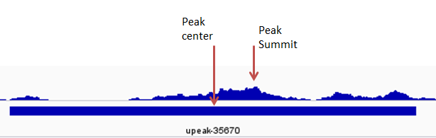

The configuration file is a .json format file that allows keys and values to be input easily and clearly. 
For running UROPA, a template of the config file will be provided. The structure of the file is shown in the following image.    

Figure 1: Configuration file example: A config file will be downloaded when UROPA is installed. The fields are empty to be filled in. Please accord further instructions for a proper annotation.   

There are three basic keys: 'queries', 'gtf', and 'bed', additionally there are two optional keys: 'priority', and 'bigwig'
By default, 'internal' and 'priority' are false.  
In a basic annotation, only the GTF and bed keys are specified, UROPA can annotate the peaks provided in the bed file by all possible feature types represented in the GTF file within a distance of max 100,000 bp. 

#queries 
The queries key is a field with nested keys, as you will see in the config template, for defining in more details the genomic feature of interest for the annotation. It can contain more than one query, written inside '{}' and separated with commas.Attention : If more than one queries given,should be included in brackets like all values, i.e [{}, {}].
It accepts the following keys for each query:

+ **features** :['gene','exon','intron','miRNA'], or other types as defined in the 3rd column  of the 'GTF'.By default all features present in the 'GTF' will be used. 

+ **distance**: [2000]. Default 100,000. It is used as the maximum allowed distance from the genomic feature to the peak center. The position of the feature to be considered for measuring the distance is the value given at 'feature.anchor'.             

+ **show.attributes**: ['gene_id', 'gene_biotype'], or other keys defined in the 9th column of the 'GTF'. Default is 'None'. The chosen attribute(s) of all queries will be shown collectively as column names in the output tables. The value of each attribute is the one that provides the identification of the annotation of each peak(e.g gene_id, gene_name). The attributes can be defined only in one query and will be considered the same for all queries. If the given attribute key doesn't exist or is not given for some features in the 'GTF', the annotated peaks will have the value 'not.found' in the attribute's column.

+ **filter.attribute** : ['gene_type'].A key that is found in the 9th column and with which one can filter their results for.The 'attribute.value' should also be given. Default:'None'

+ **attribute.value** : ['protein_coding']. The value of the key corresponding to the 'filter.attribute'.It will be used for annotating the peaks only with features that contain this value. Default:'None'

+ **feature.anchor** : ['start']. The position from which the distance to the peak center will be measured for annotating the peak with the best feature (the closest). Default:  ['start', 'center', 'end']. If default values used, the distance of all positions will be measured from the peak center and if the minimum of the three compared distances is less than or equal to the 'distance' given, the feature will be accepted for annotation: closest.distance = min (|feat.start - p.center|, |feat.center - p.center|, |feat.end - p.center|)   < 'distance'. 

+ **strand**: '+' .The strand on which the annotated feature should be. Default: ['+', '-' ]. If peaks are stranded (strand given in 6th column of 'bed' file),       
the strand of the peak will be considered and not the 'strand' given here. If peak.strand = ' . ' , the strand given here will be considered instead.                        

+ **direction** : [ 'upstream', 'downstream' ], for defining the peak location relative to the feature's direction. Default: 'any_direction'.                
A peak is 'upstream' when it is closer to or overlapping with the TSS of the feature.Similar for downstream but to the end position(TTS) of feature. Only when a peak is upstream/downstream of the feature it will be annotated with it. Otherwise it will be reported as 'NA'.              

+ **internals**: ['T',True','F','False','Y','Yes','N','No'].If True, the features found completely inside a peak region OR a peak found inside a feature region will be considered a valid pair for annotation, even if  the distance of 'feature.anchor' from peak center is further than the desired 'distance'. This key can be helpful to identify peaks all along the features, or for the allocation of ATAC-seq peaks to very small transcription factor binding sites(tfbs). Default='False'.

#priority    
**priority** : ['T', 'True', 'F', 'False', 'Y', 'Yes', 'N', or 'No'].Default :'False'. This key is useful when more than one query is defined. If 'True',              
a peak can be annotated according to the second query, only if a feature matching to the first query is not found. Respectively for further queries.               
If 'False', all given queries are considered equally and any feature matching with any of these queries will annotate the peaks. The query that allowed each feature to be selected for annotation will be shown in the last column of the output tables. If only one query is provided, the value of 'priority' can be 'True' or 'False', without any difference in the output annotation.

#gtf 
The GTF file should be of the standard GTF format (9 columns), as described by [Ensembl GTF format](http://www.ensembl.org/info/website/upload/gff.html>). 
The GTF file acts as annotation database. If it is not in the right format, a conversion can be done by UROPA. For more information see [Custom annotation](custom.md)

#bed
The BED file can be any tab-delimited file containing the detected enriched regions from a peak-calling tool (e.g. MACS2, MUSIC, FindPeaks, CisGenome, PeakSeq)             
or any other table with genomic regions of a minimum of 3 columns and complying with the known BED format, as described by [Ensembl Bed format](http://www.ensembl.org/info/website/upload/bed.html).

#bigWig 
A 'bigwig' file is optional and if specified, it gives the advantage of the peak summit, which can give a more precise annotation than the peak center. As shown in the image below,             
sometimes the center (geometric mean) is not the real center of the enriched region. (function 'find_summit', which checks compatibility of bigwig-bed for the 'chr-' prefix             
and can create new file when one of them is incompatible.)          

Figure 2: Different distance calculation when bigwig file is given: The summit is the real local maxima of the enriched region, and the distance will be calculated from this location. This leads to a more precise annotation.

**Important Note**: In order for the default values to be active, the key itself shouldn't be present and empty in the config file.                  
In case there exist a key without value, an error message will advise you to fill in or omit the key.  