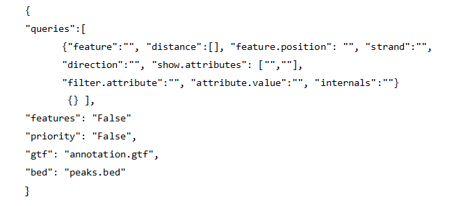

The configuration file is a .json format file that allows keys and values to be input easily and clearly. 
For running UROPA, a template of the config file will be provided. The structure of the file is shown in the following image. 

There are three basic keys: 'queries', 'gtf', and 'bed'.Additionally, there are two optional keys: 'priority', and 'bigwig'
All keys are further described below:

* Queries: The queries key is a field with nested keys, as you will see in the config template, for defining in more details the genomic feature of interest for the annotation. It can contain more than one query, written inside '{}' and separated with commas. It accepts the following keys for each query:
	* 'features': ['gene', 'exon', 'intron', 'miRNA'] or other types as defined in the 3rd column of the 'gtf'.By default all the features present in the 'gtf' will be used for the peak annotation.
	
	* 'distance': [2000].Default 100,000. It is used as the maximum allowed distance from the genomic feature to the peak center. The position of the feature for the measured distance is the chosen key:'feature.position'. This key in combination with the 'feature.position' is used to detect the best annotation for the peaks.
	
	* 'feature.position': ['start']. The position from which the distance to the peak center will be measured for annotating the peak with the best feature (the closest). Default:  ['start', 'center', 'end']. If default values used, the distance of all positions will be measured from the peak center and if the minimum of the three compared distances is less than the 'distance' given, the feature will be accepted for annotation: closest.distance = min (\|feat.start - p.center\|, \|feat.center - p.center\|, \|feat.end - p.center\|)   < 'distance' 
	This key in combination with the distance is part of the filtering process for the best annotation.
	
	* 'strand': ['+'] .The strand on which the annotated feature should be. Default: ['+', '-' ]. If peaks are stranded (strand given in 6th column of 'bed' file), the strand of the peak will be considered and not the 'strand' given here. If peak.strand = '.', the strand given in this key (in config) will be considered. 
	
	* show.attributes: ['gene_id', 'gene_biotype'], or whatever is defined in the 9th column of the 'gtf'. Default is 'None'. The chosen attribute(s) of all queries will be shown collectively as column names in the output tables. The value of each attribute is the one that provides the identification of the annotation of each peak(e.g gene_id, gene_name). The attributes can be defined only in one query and will be considered the same for all. If the given attribute key doesn't exist in the 'GTF', the annotated peaks will have the value 'not.found' in the attribute's column. So make sure, that an existing attribute will be chosen in order to obtain a valid annotation and an informative display of the results.
	
	* 'filter.attribute': ['gene_type'].A key that is found in the 9th column and with which you want to filter your results for.'attribute.value' should also be given.Default:'None'.
	
	* 'attribute.value':['protein_coding']. The value of the key that is given in the 'filter.attribute' to be used for choosing only features that contain this key.Default:'None'
	
	* 'direction': ['upstream', 'downstream'], for defining the peak location relative to the genomic feature where it overlaps or is closer to. Default: 'any_direction'. A peak is 'upstream' when it is closer to the TSS of the feature, while downstream is when it is closer to the end position(TTS). An overlap is allowed only to small starting or ending part of the peak (10% of the peak length). If the direction of the feature doesn't agree with the demanded 'direction', the peak will not be annotated, but will be instead shown as 'NA' in the output tables. 
	
	* 'internals' : ['True','T','False','F'].Default: 'False'. If 'True', the features found completely inside a peak region, or, peaks found inside a feature region will be annotated even if their distance is larger than the 'distance' given.The column 'genomic_location' in the output tables will display the labels 'FeatureInsidePeak' or 'PeakInsideFeature',respectively.

* priority: 'T', 'True', 'F', 'False', 'Y', 'Yes', 'N', or 'No'.Default is 'False'. This key is useful when more than one query is defined. If it is defined as 'True', a peak can be annotated according to the second query, only if a feature matching to the first query is not found. Respectively for further queries. If it is defined as 'False', all given queries are considered equal and any feature matching with any of these queries will annotate the peaks. The query that allowed each feature to be selected for annotation will be shown in the last column of the output tables. If only one query is provided, the value of 'priority' can be 'True' or 'False', without any difference in the output annotation.

* gtf: The 'gtf' file should be of the standard gtf format (9 columns), as described by [Ensembl GTF format](http://www.ensembl.org/info/website/upload/gff.html>). The gtf file acts as annotation database. If it is not in the right format, a conversion can be done by UROPA. For more information see [Custom annotation](custom.md)

* bed: The 'bed' file can be any tab-delimited file containing the detected enriched regions from a peak-calling tool (e.g. MACS2, MUSIC, FindPeaks, CisGenome, PeakSeq) or any other table with genomic regions of interest,with a minimum of 3 columns and complying with the known bed format, as described by [Ensembl Bed format](http://www.ensembl.org/info/website/upload/bed.html).

* bigwig: A 'bigwig' file is optional and if specified, it gives the advantage of the peak summit, which can give a more precise annotation than the peak center. As shown in the image below, sometimes the center (geometric mean) is not the real center of the enriched region. (function 'find_summit', which checks compatibility of bigwig-bed for the 'chr-' prefix and can create new file when one of them is incompatible.)

**Important Note**: In order for the default values to be active, the key itself shouldn't be present and empty in the config file.
In case there exist a key without value, an error message will advise you to fill in or omit the key.  