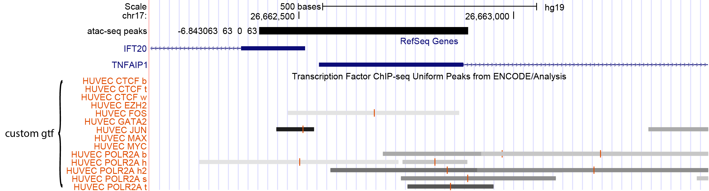

The gtf file is a very common format used for annotation. UROPA accepts all gtf files downloaded from any online databases,              
such as UCSC, ensembl, GENCODE. The file fromat is well-explained by [Ensembl](http://www.ensembl.org/info/website/upload/gff.html )       
The Gencode v19 annotation gtf looks for example like shown in Table 1.                  
                                                                                                                                                                                                                                                                                                                                                                                                                | 
|----|------|----------|-----|-----|-|-|-|-------------------------------------------------------------------------------------------------------------------------------------------------| 
|chr1|HAVANA|gene      |11869|14412|.|+|.|gene_id "ENSG00000223972"; transcript_id "ENSG00000223972.4"; gene_type "pseudogene"; gene_status "KNOWN"; gene_name "DDX11L1"; transcript_type "pseudogene"; transcript_status "KNOWN";transcript_name "DDX11L1"; level 2; havana_gene "OTTHUMG00000000961.2";                                                                          | 
|chr1|HAVANA|transcript|11869|14409|.|+|.|gene_id "ENSG00000223972"; transcript_id "ENST00000456328.2"; gene_type "pseudogene"; gene_status "KNOWN"; gene_name "DDX11L1"; transcript_type "processed_transcript"; transcript_status "KNOWN"; transcript_name "DDX11L1-002"; level 2; tag "basic"; havana_gene "OTTHUMG00000000961.2"; havana_transcript "OTTHUMT00000362751.1";               | 
|chr1|HAVANA| exon     |11869|12227|.|+|.|gene_id "ENSG00000223972"; transcript_id "ENST00000456328.2"; gene_type "pseudogene"; gene_status "KNOWN"; gene_name "DDX11L1"; transcript_type "processed_transcript"; transcript_status "KNOWN"; transcript_name "DDX11L1-002"; exon_number 1;  exon_id "ENSE00002234944.1";  level 2; tag "basic"; havana_gene "OTTHUMG00000000961.2"; havana_transcript "OTTHUMT00000362751.1";| 
|...                                                                                                                                                                                       | 

Table 1: head of gencode v19 gtf file, the columns are: chr, source, feature, start, end, score, strand, frame, and attributes. (Left out description header) 

For further extending the utility of UROPA, the tool allows annotation files that are not in this format. UROPA can convert them to this format. 
Files for annotation can for example be provided by the [UCSC Table Browser](https://genome.ucsc.edu/cgi-bin/hgTables).    
For the internal convertion, the input annotation file needs to have a header, and there need to be columns with information about the location,      
e.g. 'chr', 'start' and 'end' . Additionally, the file should be tab separated.  Another requirement for the transformation is,      
that the file name should be explicit for the file content. For example, if transcription factor binding sites (tfbs) were downloaded from UCSC table browser,         
the name of the file could be the name of the table 'wgEncodeAwgTfbsBroadHuvecCtcfUniPk.txt'. The file name will be one information in the attribute column. 
There are two variations of the gtf file generator

1.	One file should be converted and used for annotation. Then the file should be given in the key 'gtf' of the config file. 
2.	Several files should be used for annotation. In this case the input should be a folder with all files included (but no others).  
	The files will be converted one by one; additionally one merged gtf file (called merged_custom_GTF.gtf) will be created. 
	For the merged file, the explicit file names are important for distinguishing the annotated features. 

The generated files will be stored in the same directory as the input file is located. 
Furthermore, there are two optional arguments that can be given for the transformation. Those are source and feature.     
If an optional argument will be used, it should be used with source=yourSource and feature=yourFeature, e.g. source=UCSC feature=tfbs.    
There should be no spaces between the character and the equal sign. If optional arguments are given, they will overwrite information from the input file(s).
If only one input file was given, the gtf file version of this file will be used as annotation file.        
If more input files were present, the merged file will be used as annotation file. 
Whitin the transformation, the input file is checked for information that is necessary for the gtf file format, like chr, start, end, strand, and more.      
If the information is present in the input file, it will be adopted to the gtf file.             
For the chromosome column it checks the format, if the chromosome is presented by 1, 2 etc., it will be reformatted to chr1, chr2 etc. format.          
The optional arguments are used in the gtf file for the corresponding column, if one optional argument is not given and this information is also not present in the input file,       
the column will be filled with undefined. For other information that is not present in the input file, the column will be filled with dots.          
All additional columns presented in the input file will be merged in the attributes column.  All that information can be represented in the UROPA output file by the key 'attributes'. 

The custom gtf transformation is useful if the peaks should not be annotated to a gene, but for example to known tfbs or other regulatory elements.            
For instance, this is handy for an ATAC-seq peak annotation.  

#Transformation Example
In Table 2 the CTCF transcription factor table from UCSC is shown. This should be part of the annotation for the ATAC-seq peaks.

| #bin | chrom | chromStart | chromEnd | name | score | strand | signalValue | pValue | qValue  | peak | 
|------|-------|------------|----------|------|-------|--------|-------------|--------|---------|------| 
| 74   | chr1  | 1310465    | 1310835  | .    | 244   | .      | 382.141     | -1     | 482.217 | 185  | 
| 76   | chr1  | 3407792    | 3408060  | .    | 1000  | .      | 178.305     | -1     | 482.217 | 129  | 
|...   |       |            |          |      |       |        |             |        |         |      |

Table 2: Downloaded table from [UCSC Table Browser](https://genome.ucsc.edu/cgi-bin/hgTables) (wgEncodeAwgTfbsBroadHuvecCtcfUniPk) for CTCF transcription factor from Uniform TFBS track.

After transformation with feature=tfbs but without given source, the gtf format annotation file will look as displayed in Table 3.  

|      |           |      |         |         |      |   |   |                                                              | 
|------|-----------|------|---------|---------|------|---|---|--------------------------------------------------------------| 
| chr1 | undefined | tfbs | 1310465 | 1310835 | 244  | . | . | signalValue  382.141 ; pValue -1 ; qValue 4.82217 ; peak 185 | 
| chr1 | undefined | tfbs | 3407792 | 3408060 | 1000 | . | . | signalValue 178.305 ; pValue -1 ; qValue 4.82217 ; peak 129  | 

Table 3: Internal transformation to gtf file format of CTCF table from UCSC.

#Advantage of UROPA internal gtf transformation vs. download the tables in gtf file format
The UCSC table browser also supports gtf file format. But whithin this gtf file, not the information about the original peak for this tfbs is disblayed,      
only the exon in which the peak is located is displayed. Additionally for this example, in the attribute column,           
there are empty information about 'gene_id' and information about peak, pValue und signalValue are lost. 
An example of the gtf output from UCSC table browser is shown in Table 4.

|      |                                         |      |         |         |            |   |   |                                      | 
|------|-----------------------------------------|------|---------|---------|------------|---|---|--------------------------------------| 
| chr1 | hg19_wgEncodeAwgTfbsBroadHuvecCtcfUniPk | exon | 1310466 | 1310835 | 244.000000 | . | . | gene_id "."; transcript_id ".";      | 
| chr1 | hg19_wgEncodeAwgTfbsBroadHuvecCtcfUniPk | exon | 1334906 | 1334997 | 630.000000 | . | . | gene_id "."; transcript_id "._dup1"; | 

Table 4: gtf file download from UCSC table browser for wgEncodeAwgTfbsBroadHuvecCtcfUniPk

The major problem with the UCSC gtf file is that in this the exon location and not the tfbs location is displayed.         
That means, the peaks that should be annotated cannot be annotated for them tfbs itself. That is why the tables should be downloaded with the output format      
'all fields from selected table' or with 'select fields from primary and related tabs'. 

Custom gtf annotation of ATAC-seq peaks
---------------------------------------
This example is based on ATAC-seq peaks ([ataq.bed](https://github.molgen.mpg.de/loosolab/UROPA/blob/master/atac-seq_example.bed)) annotated with the internal generated gtf file from the following tables from [UCSC Table Browser](https://genome.ucsc.edu/cgi-bin/hgTables),    
called [merged_custom_GTF](https://github.molgen.mpg.de/loosolab/UROPA/blob/master/merged_custom_GTF.gtf).  
* wgEncodeAwgTfbsBroadHuvecCtcfUniPk
* wgEncodeAwgTfbsBroadHuvecEzh239875UniPk
* wgEncodeAwgTfbsBroadHuvecPol2bUniPk
* wgEncodeAwgTfbsHaibHuvecPol2Pcr1xUniPk
* wgEncodeAwgTfbsHaibHuvecPol24h8V0416101UniPk
* wgEncodeAwgTfbsSydhHuvecCfosUcdUniPk
* wgEncodeAwgTfbsSydhHuvecCjunUniPk
* wgEncodeAwgTfbsSydhHuvecGata2UcdUniPk
* wgEncodeAwgTfbsSydhHuvecMaxUniPk
* wgEncodeAwgTfbsSydhHuvecPol2UniPk
* wgEncodeAwgTfbsUtaHuvecCmycUniPk
* wgEncodeAwgTfbsUtaHuvecCtcfUniPk
* wgEncodeAwgTfbsUtaHuvecPol2UniPk
* wgEncodeAwgTfbsUwHuvecCtcfUniPk

The config file could look like followed:
{"queries": [{"feature": "tfbs", "attribute":"table", 
"distance": "500", "feature.position": "center"}],
"gtf": "merged_custom_GTF.gtf", 
"bed": "atac-seq_example.bed"}

As you can see in Figure 1 there are many transcription factor binding sites (tfbs) co-localized close to the annotated peak -2.963782_36_0_36 (chr17:26,662,487-26,662,883). 

With the given configuration, most of them are annotated with UROPA. Part of the All hits table for peak -2.963782_36_0_36 is represented in Table 5.

| h_start  | h_end    | distance | table                                        | 
|----------|----------|----------|----------------------------------------------| 
| ...      |          |          |                                              | 
| 26662474 | 26662874 | 11.0     | wgEncodeAwgTfbsSydhHuvecCfosUcdUniPk         | 
| 26662742 | 26662892 | 132.0    | wgEncodeAwgTfbsHaibHuvecPol24h8V0416101UniPk | 
| 26662574 | 26663114 | 159.0    | wgEncodeAwgTfbsHaibHuvecPol2Pcr1xUniPk       | 
| 26662753 | 26662953 | 168.0    | wgEncodeAwgTfbsUtaHuvecPol2UniPk             | 
| 26662268 | 26662732 | 185.0    | wgEncodeAwgTfbsHaibHuvecPol24h8V0416101UniPk | 
| 26662448 | 26662535 | 193.5    | wgEncodeAwgTfbsSydhHuvecCjunUniPk            | 
| 26662737 | 26663099 | 233.0    | wgEncodeAwgTfbsSydhHuvecPol2UniPk            | 
| 26662695 | 26663251 | 288.0    | wgEncodeAwgTfbsBroadHuvecPol2bUniPk          | 
| ...      |          |          |                                              | 

Table 5: Cutout of All hits from custom annotation of ATAC-seq peaks

Most of the co-localized tfbs are pol2 binding sites, which could be explained by the two close TSSs within this frame.     
Furthermore, there are binding sites FOS (MA0099.2 FOS::JUN JASPAR 2016), which is the annotation for the peak, and JUN (MA0488.1 JUN JASPAR2016).     
Among other proteins, c-Fos and c-Jun proteins built a menagerie of dimeric basic region-leucine zipper which is known as activator protein-1 (AP-1),      
AP-1 is a transcription factor that is known to regulate gene expression[1](AP-1 as a regulator of cell life and death, doi:10.1038/ncb0502-e131)              

