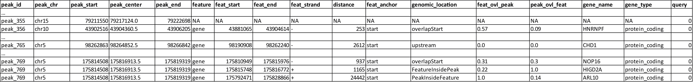
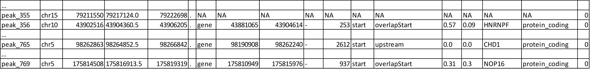
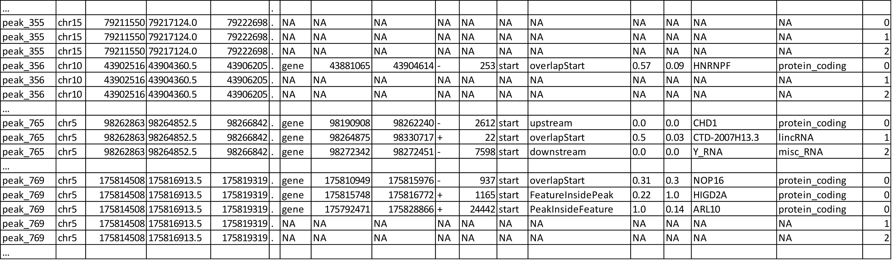
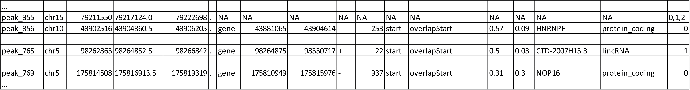
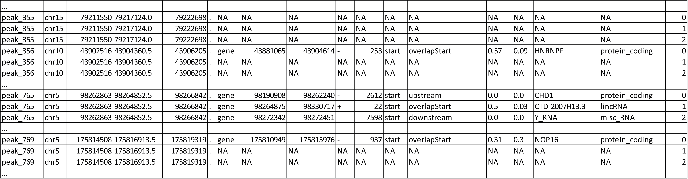
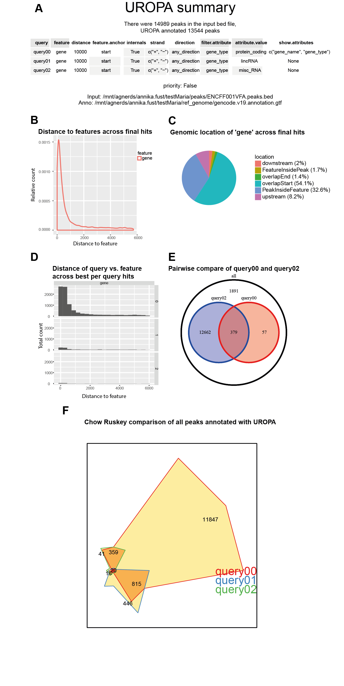

UROPA provides many output files, each providing valuable information in either a more extended or a more condense way, to cover all needs and be useful for further analyses.

The different outputs will be explained thoroughly below.

# File overview
* **Uropa_AllHits**  : The basic output table giving for each peak all valid annotations and additionally NA rows for invalid annotations.

* **Uropa_FinalHits** : The table which can be the most useful for peak annotation.It provides the best-selected feature according to the config criteria for annotating each peak. The closest distance is the basic parameter for the selection. It also summarizes the 'BestperQuery_Hits' by chosing the closest feature for each peak in case more queries are given and each query validates a different feature.

* **Uropa_BestperQuery_Hits** : Only if more than one query is specified: Best valid annotation per query for each peak.

* **Uropa_Reformatted_HitsperPeak** : Only if more than one query is specified and the *-r* parameter is used: Compact table with best per query annotation in one row. 

* **Uropa_Summary.pdf** : Only if the *-s* parameter is used: Graphical information of the peak annotation run by UROPA.

**Note** : The output files will be named additionally by the output directory name where they are located, for convenience in further use and transfer of files.
Example  : ChIPannot/Uropa_AllHits_*ChIPannot*.txt


#Output columns explanation

The four output tables mentioned above contain many informative columns about the peak annotation performed. The headers and content of tables are explained here :
**peak_id, peak_start, peak_center, peak_end** : Peak information with id if available, otherwise a peak id in chr:start-end scheme will be created.

**feature, feat_start, feat_end, feat_strand** : The information of the genomic feature that annotates the peak, as extracted by the gtf file.

**feat_anchor**: The position of the genomic feature annotated, having the minimum distance to the peak.center. If 'feature.anchor' given in config only this will be shown.

**distance** : The distance measured as following: _abs(peak_center-feature_anchor)_. If no feature.anchor is given, the minimum of all feature.anchor {start,center,end} to peak_center is chosen.

**genomic_location**: The position of the peak relative to the annotated feature direction (e.g. upstream = peak located upstream of the gene, see Figure 2 in [Usage Examples](http://uropa.readthedocs.io/en/latest/uropa-example/#example-2-direction-key)).

**feat_ovl_peak**: When peak and feature overlap(i.e genomic_location = overlapStart), Ratio(overlapping region / peak length) shows percentage of peak covered by the feature.(i.e 1.0 = 100% of peak covered, peak is internal.

**peak_ovl_feat**: When peak and feature overlap(i.e genomic_location = FeatureInsidePeak), Ratio(overlapping region / feature length) shows percentage of feature covered by the peak.(i.e 1.0 = 100% of feature covered, feature is internal.)

**gene_name, gene_id, gene_type** : Attributes that have been given in the key 'show.atttributes' will be shown here and their values extracted by the gtf will be displayed for each feature.If 'filter.attribute' contains same attribute keys, this column helps confirming the filtering.
**Important Note** : Make sure to give any attributes for display in the output-if existant in the 9th column of the gtf - otherwise the annotated peaks will be reported 
without any information of the assigned features.

**query**: The query that validates with its given parameters the feature to be assigned to the peak.If only one query given, column will always display '0',the first query.


#Output files (one query)
UROPA annotation with one query results in two output tables. Those are the Uropa_AllHits and Uropa_FinalHits. 
With a configuration as followed, a cut out of the AllHits would look as in Table 1, and a cut out of the FinalHits as displayed in Table 2. Peak and annotation files are further described [here](http://uropa.readthedocs.io/en/latest/uropa-example/#used-peak-and-annotation-files). 
The UROPA annotation process for one query can run into three cases for each peak, those are:

* **Case 1**: No query gives any feature for annotating the peaks, this leads to no valid annotation at all -> NA row in AllHits and FinalHits. 
	
* **Case 2**: There is one valid annotation for the specified query -> annotation will be given in AllHits and FinalHits. 
	
* **Case 3**: There are multiple valid anntoations for the specified query -> all valid annotations will be given in the AllHits, the best annotation (smallest distance) will be presented in the FinalHits.  

```json
{
"queries":[
		{"feature":"gene", "distance":10000, "feature.anchor":"start", "internals":"True", 
			"filter.attribute":"gene_type", "attribute.value":"protein_coding",
			"show.attributes":["gene_name","gene_type"]}], 
 "priority" : "False",
 "gtf":"gencode.v19.annotation.gtf" ,
 "bed":"ENCFF001VFA.bed"
}
```

	
_Table 1: AllHits for one query
The column order is: peak_id, peak_chr, peak_start, peak_center, peak_end, peak_strand, feature, feat_start, feat_end, feat_strand, distance, feat_anchor, genomic_location, feat_ovl_peak, peak_ovl_feat, gene_name, gene_type, query_


	
_Table 2: FinalHits for one query
The column order is: peak_id, peak_chr, peak_start, peak_center, peak_end, peak_strand, feature, feat_start, feat_end, feat_strand, distance, feat_anchor, genomic_location, feat_ovl_peak, peak_ovl_feat, gene_name, gene_type, query_


As displayed in Table 1 and 2, peak_355 is a representative of Case 1. There is no valid annotation at all, there is an NA row in both output tables. 
The peaks 356 and 765 belong to Case 2, there is one valid annotation for them, their annotation is displayed in the same way in AllHits and FinalHits (Table 1 and 2). 
Whereas peak_769 has three valid annotations for the specified query. All of them are displayed in the AllHits output (Table 1). In the FinalHits only the best annotation, the one for gene NOP16 with the minimal distance of 937 is represented in the FinalHits (Table 2).


#Output files (multiple queries)
UROPA annotation with multiple queries result in at least three output tables. Those are the Uropa_AllHits, Uropa_FinalHits, and Uropa_BestperQuery_Hits. If the *-r* parameter is added in the command line call, there will the additional output Uropa_Reformatted_HitsperPeak file.
With a configuration as followed, a cut out of all generated output files will look as in Table 3 to 6 and Figure 1. Peak and annotation files are further discribed [here](http://uropa.readthedocs.io/en/latest/uropa-example/#used-peak-and-annotation-files). 
The UROPA annotation process for multiple queries can run into one more case as described for one query:

* **Case 1 to 3** as described above

* **Case 4**: There are valid annotations for multiple queries -> all valid annotations will be given in the AllHits, the best annotation (smallest distance across all queries) will be presented in the FinalHits. 

```json
"queries":[
		{"feature":"gene", "distance":10000, "feature.anchor":"start", "internals":"True", 
			"filter.attribute":"gene_type",  "attribute.value":"protein_coding",
			"show.attributes":["gene_name","gene_type"]},
		{"feature":"gene", "distance":10000, "feature.anchor":"start", "internals":"True", 
			"filter.attribute":"gene_type",  "attribute.value":"lincRNA"},
		{"feature":"gene", "distance":10000, "feature.anchor":"start", "internals":"True", 
			"filter.attribute":"gene_type",  "attribute.value":"misc_RNA"},
          ],
"priority" : "False",
"gtf": "gencode.v19.annotation.gtf",
"bed": "ENCFF001VFA.peaks.bed"
}
```

	
_Table 3: AllHits for multiple queries
The column order is: peak_id, peak_chr, peak_start, peak_center, peak_end, peak_strand, feature, feat_start, feat_end, feat_strand, distance, feat_anchor, genomic_location, feat_ovl_peak, peak_ovl_feat, gene_name, gene_type, query_

	
_Table 4: FinalHits for mulitple queries
The column order is: peak_id, peak_chr, peak_start, peak_center, peak_end, peak_strand, feature, feat_start, feat_end, feat_strand, distance, feat_anchor, genomic_location, feat_ovl_peak, peak_ovl_feat, gene_name, gene_type, query_


	
_Table 5: Uropa_BestperQuery_Hits for multiple queries
The column order is: peak_id, peak_chr, peak_start, peak_center, peak_end, peak_strand, feature, feat_start, feat_end, feat_strand, distance, feat_anchor, genomic_location, feat_ovl_peak, peak_ovl_feat, gene_name, gene_type, query_

Same as in the example with one query, peak_355 has no valid annotation at all and is represented as NA row in all produced output tables, correspond to Case 1. In the AllHits (Table 3) and BestperQuery_Hits (Table 5) there will be one NA row for each query, but in the FinalHits (Table 4) there will be only one NA row for all queries. 
The peak_356 has only for one query a valid annotation, this presented in AllHits, FinalHits, and BestperQuery_Hits conform to Case 2. In AllHits and BestperQuery_Hits there are additional NA rows for this peak for the other queries. 
For peak_765 there are valid annotations for all queries as displayed in the AllHits, representing Case 4. The best of them with the smalles distance is the annotation for the lincRNA, this annotation is displayed in the FinalHits. 
Because there is only one valid annotation for each query, all of this annotations are also displayed in the BestperQuery_Hits. 
This is different for peak_769, as described above this peaks equates to Case 3. With multiple queries, there will be additional NA rows for the invalid queries in the AllHits and BestperQuery_Hits. 

With multiple queries it is also possible to reformat the BestperQuery_Hits the a condensed format with the best per query annotations for each peak in one row.
A reformatted example for the BestperQuery_Hits of Table 5 is presented below. Because this Table is very broad, it is splitted into two part. The Reformatted_HitsperPeak represents all information for each peak in one row.  

	
_Table 6.1: Uropa_Reformatted_HitsperPeak for multiple queries part one
The column order is: peak_id, peak_chr, peak_start, peak_center, peak_end, peak_strand_

	
_Table 6.2: Uropa_Reformatted_HitsperPeak for multiple queries part two
The column order is: feature, feat_start, feat_end, feat_strand, distance, feat_anchor, genomic_location, feat_ovl_peak, peak_ovl_feat, gene_name, gene_type, query_


#Summary Vizualisation

For every run there is also a summary output, vizualising the results for a global overview of the final annotation. Within this document one can find : 

A summery of the UROPA run: Used peak and annotation files, number of peaks and number of annotated peaks, specified queries, value of priority flag (Fig. 1A). If not all queries annotated peaks, this is also mentioned.

---> Graphs based on the 'FinalHits' output:

* A density plot displaying the distance per feature across all queries (Fig. 1B). 
* A pie chart illustrating the genomic locations of the peaks per annotated feature (Fig. 1C).
* A barplot displaying the occurrence of the different features, if there is more than one feature assigned for peak annotation (not illustrated due to one feature in this example).

**Figure 1 A-C would be the summary for the first UROPA run with only one query***

---> Graphs based on the 'BestperQuery_Hits' output:

* A distribution of the distances per feature per query are displayed in a histogram (Figure 1D).
* A pie chart illustrating the genomic locations of the peaks per annotated feature (not illustrated).
* A pairwise comparison among all queries is evaluated within a venn diagram, when more than one query is given in the config file (One pairwise comparison displayed in Figure 1E). 
* Chow Ruskey plot with comparison across all defined queries (for three to five annotation queries)(Figure 1F).

	
_Figure 1: Summary Example for queries as described above: (A) Summery of specified queries, used annotation and peak files, and how many peaks were present and annotated, (B) Distance density for all features based on FinalHits, (C) Pie Chart representing genomic location for each feature across FinalHits, (D) Distance per query per feature across BestperQuery_Hits, (E) Pairwise comparison across all queries displayed in Venn diagramms, (F) Chow Ruskey plot to compare all queries._


