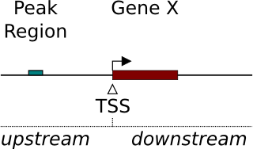
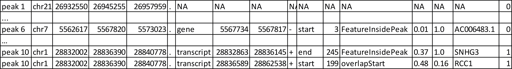

In this section several examples for the usage of the config file are presented. 
A detailed introduction of how to use the config file can be found in the section [Configuration file](http://uropa.readthedocs.io/en/latest/uropa-example/).
There is also a detailed information about the different output formats in the section [Output](http://uropa.readthedocs.io/en/latest/output/).


Example 1: 'feature.anchor' key
-------------------------------
UROPA allows a flexibility of annotation for features. With the key 'feature.anchor' it is possible to decide from where the distance to the peak should be calculated. 
Typically, the distance is calculated from the TSS, correspond to 'start' in UROPA. Furthermore, it is possible to use the 'center' and 'end' of the feature for the distance calculation. 

If no value is given, the distances from all three positions to the peak center are calculated and the closest is choosen. Only if the choosen distance is smaller or equal to the distance defined in the 'distance' key, the peak will be annotated for that feature.                                                                                        The position closer to the peak.center will be indicated in the output file in the column **'feat_anchor'**.

There are two queries with different 'feature.anchor' for this example. 

```json
{"queries": [ 
	{"feature":"gene", "distance":5000, "feature.anchor": "start", "show.attributes":"gene_name"},       
	{"feature": "gene","distance":5000, "feature.anchor": "center"}],
"priority" : "False",
"gtf": "gencode.v19.annotation.gtf",
"bed": "ENCFF001SUE.bed"}
```

As displayed in the output below (Table 1), the peak could only be annotated for query 1 where 'feature.anchor' is set to 'center' and the measured distance is within the accepted cut-off value. 
The location of the gene and the peak of interest (highlighted in black colour) are shown in the Figure 1. The gene *BCL2L13*  is very large, that is why the measurement of distance from 'start' position couldn't return a valid annotation. _feature.start – peak.center = |18111621-18161442| = 49,821_


	
_Table 1: AllHits with annotation with two queries containing different 'feature.anchor' and 'priority' = 'False'              
The column order is: peak_id, peak_chr, peak_start, peak_center, peak_end, peak_strand, feature, feat_start, feat_end, feat_strand, distance, feat_anchor, genomic_location, feat_ovl_peak, peak_ovl_feat, gene_name, gene_type, query_


_Figure 1: The  peak71 (chr22:18161387-18161496) from annotated with the gene *BCL2L13* from gencode, at a distance 1063bp from feature.center to peak.center_

Concerning the other output tables, 

* FinalHits will only contain the second column with a valid annotation

* BestperQuery_Hits will be the same as the AllHits in this case, because there are no multiple valid annotations for one query.


**Note** : Similar cases of peaks being internally to the genomic region of a feature (and also features being internally to a peak region) 
can be well-annotated using the key 'internals'. A example for this is presented in [Example 3](http://uropa.readthedocs.io/en/latest/uropa-example/#example-3-internals-key).


Example 2: 'direction' key
--------------------------

In the following example the utility of the key 'direction' will be illustrated. It is optional but can be a very important player for a specialized annotation.                  

When the direction key is set to **'upstream'**, peaks will be annotated to a feature if the peak center is upstream of the feature and the distance from the 'feature.anchor' is smaller than the distance required in the config file. The same would be for **'downstream'**  where the location of the peak should be downstream of the gene (Figure 2).

So,the location of the peak is relative to the feature’s direction, and furthermore, the closest 'feature.anchor' is actually the 'start' when peak is upstream, while on the contrary, it is the 'end', if the peak is downstream.  This is why in the example the 'feature.anchor' will be used with default values.

An overlap of the feature to the start or end of the peak is partially allowed, but the overlap should allow a clear evidence of the upstream or downstream location of the peak.




_Figure 2 : Possible locations of a peak. There are five peaks close to gene A: The first peak (from left) is located upstream of it, it would be annotated within a direction:upstream annotation an has the genomic location upstream. 
The second peak would also be annotated within a direction:upstream process because the peak center is upstream of the feature start position, but the genomic location for this peak would be overlapStart instead of upstream. The third peak would not be annotated with direction:upstream, but if the configuration allows an annotation, the genomic location would be PeakInsideFeature. Among other configurations, the next two peaks (third and fourth), would be annotated in a direction:downstream configuration. Like described for upstream, both peaks are located downstram of gene A, but with differen genomic locations: overlapEnd and downstream. The sixed peak from left could be annotated for gene B which is located inside it, representing the genomic location FeatureInsidePeak. The last two peaks close to gene C have the genomic locations overlapStart and overlapEnd, but due to that the center is not upstream or rather downstream, they would not be annotated for direction:upstream or direction:downstream annotation keys._ 

  

_Figure 3: H3K4me1 peak annotated with the Gencode genome, the genomic location is chr1:1,403,500-1,408,500_

The peak, the following example is based on is displayed in Figure 3. 
Configuration for the first annotation run:
```json
{"queries": [{"feature": "gene", "attribute":"gene_name", "distance":1000, "direction":"any_direction"}],
"priority" : "False",
"gtf": "gencode.v19.annotation.gtf",
"bed": "ENCFF001SUE.bed"}
```

The peak displayed in Figure 3 would be annotated for both genes as shown in the table below:


_Table 2: AllHits for an H3K4me1 peak annotated for two genes with different directions of the peak                      
The column order is: peak_id, peak_chr, peak_start, peak_center, peak_end, peak_strand, feature, feat_start, feat_end, feat_strand, distance, feat_anchor, genomic_location, feat_ovl_peak, peak_ovl_feat, gene_name, gene_type, query_


Due to the fact that no 'feature.anchor' was defined, the distance shown in the table is measured from the closed feature.anchor: 'start' for  *ATAD3B*, 'end' for *ATAD3C* .

In this case, the annotation for gene *ATAD3C* with a distance of 712 bp would be represented in the FinalHits. Due to the knowledge that the peak represents H3K4me1 peaks, biologically it might be more probable to annotate it for *ATAD3B*.
With this kind of estimation of your data, the 'direction' key can be used for a more specialized annotation.
Configuration for the second annotation run:
```json
{"queries": [{ "feature": "gene", "attribute":"gene_name", "distance":1000, "direction":"upstream" }],
"priority" : "False",
"gtf": "gencode.v19.annotation.gtf",
"bed": "ENCFF001SUE.bed"}
```


In this case the peak will only be annotated for *ATAD3B* , because it is located 'upstream' to it. The annotation for *ATAD3C*  is no longer, even though the distance is closer. 


So, globally, this example shows that more specific annotation can be useful for peaks like this one, in order to obtain a unique feature matching more specific requirements. 
There is interest in cases where for example, some genomic regions are known to be enriched in transcriptionally active promoters, and we would like to know to which features these regions are found upstream. Moreover, a ‘downstream’ direction could be useful for the targeted identification of miRNAs or 3’UTR-binding proteins.

Example 3: 'internals' key
--------------------------
By default the parameter 'internals' is set to 'False'. With this setting, peaks are only annotated with features whose 'distance' is smaller than the defined one in the config.          

But there are cases where the genomic feature is larger than the set 'distance' and this case can lead to unannotated peaks, even if the peak is located inside the genomic feature interval (seen in the Example 1).     
Same the other way around, there exist very large peaks containing small features inside their interval. 
The 'internals' key was implemented exactly for these cases.   

So, peaks with a max distance from the feature are normally annotated with it, but **also** those who contain the feature internally, or are included in the features region. 
These internal features are the only ones allowed to be in a larger distance than the set 'distance'.

Especially, when predicted peaks used for annotation are very small (e.g. ATAC-seq peaks) or very large, this option becomes very handy.   
This example is based on the peak displayed in Figure 4. The peak is very large and the region includes three different genes. 


_Figure 4: A polR2A-peak annotated with Ensembl, genomic location: chr6 : 27,858,000 - 27,863,000_
 
Configuration for the first annotation run:
```json
{"queries":[{"feature":"gene", "distance":500, "show.attributes":"gene_name", "internals" : "False"}],
"gtf":"Homo_sapiens.GRCh37.75_chr.gtf",
"bed":"ENCFF001VFA.bed"}
```


_Table 3: AllHits with "internals":"False" for the peak_13 of ENCFF001VFA.                    
The column order is: peak_id, peak_chr, peak_start, peak_center, peak_end, peak_strand, feature, feat_start, feat_end, feat_strand, distance, feat_anchor, genomic_location, feat_ovl_peak, peak_ovl_feat, gene_name, gene_type, query_

As displayed in Table 3, there are two valid annotation for the given configuration. But the third gene in this genomic regions is missed.

Configuration for the second annotation:
 Configuration for the first annotation run:
```json
{"queries":[{"feature":"gene", "distance":500, "show.attributes":"gene_name", "internals" : "True"}],
"gtf":"Homo_sapiens.GRCh37.75_chr.gtf",
"bed":"ENCFF001VFA.bed"}
```


_Table 4: AllHits with "internals":"True" for the peak_13 of ENCFF001VFA.              
The column order is: peak_id, peak_chr, peak_start, peak_center, peak_end, peak_strand, feature, feat_start, feat_end, feat_strand, distance, feat_anchor, genomic_location, feat_ovl_peak, peak_ovl_feat, gene_name, gene_type, query_

As displayed in Table 3 there are three genes annotated for the peak. One more valid annotation as without the 'internals' key set True. All of them are located inside of the peak as shown in Figure 4.    
Whether the peak is inside the feature or the feature in the peak is displayed in the genomic_location column of the output files. 

These examples make overally evident, that depending on the biological relevance, it can be very useful to utilize more flexible keys and allow better control of results. 


Example 4: 'filter.attribute' + 'attribute.value' keys
---------------------------------------------------------

If the annotation should be more particularized, the linked keys 'filter.attribute' + ' 'attribute.value' can be used. With those it is possible to further restrict the annotation. 
For example, the peaks should not just be annotated genes but protein coding genes. Things like this can be done with the linked keys, for example with the following configuration:

```json
{"queries":[{"feature":"gene", "distance":5000, "show.attributes":["gene_name","gene_biotype"],
			"filter.attribute": "gene_biotype", "attribute.value": "protein_coding"}],
"gtf":"Homo_sapiens.GRCh37.75_chr.gtf",
"bed":"ENCFF001VFA.bed"}
```

**Attention** : The two keys "filter.attribute" and "attribute.value" are dependent, both have to be given for a proper use of filtering. Additionally, it is just possible to filter for values given in the attribute column. GTF source files can contain different attribute keys and values, so make sure the chosen values are present.

As shown in the AllHits Table 4, the annotated peaks are only for protein coding genes. This is a stricter form of annotation. Of course all other attributes in the annotation file can be used.
Using this keys can be very useful in combination with the 'priority' flag. With setting it 'True' it is possible to prioritize 'protein_coding' genes over 'pseudogenes' etc. 
It is advised to use the 'filter.attribute' key also in 'show.attributes' key, too. With this is is displayed in the output files as well which is useful if several linked keys are represented in the configuration. 


_Table 5: AllHits for annotation with linked keys 'filter.attribute' + 'attribute.value'.                    
The column order is: peak_id, peak_chr, peak_start, peak_center, peak_end, peak_strand, feature, feat_start, feat_end, feat_strand, distance, feat_anchor, genomic_location, feat_ovl_peak, peak_ovl_feat, gene_name, gene_type, query_


Example 5: 'priority' flag
-----------------------------

More than one query can be given, keeping the same gtf and bed files, allowing for a combination of annotation in one run.    
If there are more queries, it is important to decide if they should be priorized. This can be done with the priority key in the config file.   
The following examples illustrate how this can be beneficial for the annotation.

This example is based on POLR2A peaks annotated with the Ensembl genome. 
Source files can be found here :[gtf and bed source files](http://uropa.readthedocs.io/en/latest/uropa-example/#used-peak-and-annotation-files)

Configuration for the first annotation with priority false:
```json
{"queries": [{"feature":"gene", "distance":1000, "show.attributes":"gene_name"},     
			{"feature":"transcript", "distance":1000}], 
 "gtf":"Homo_sapiens.GRCh37.75_chr.gtf",
 "bed":"ENCFF001VFA.bed"}
```

The above set of queries will allow UROPA to annotate peaks for genes and transcripts. As priority is False (default), there is no query priorized. 
As presented in the AllHits Table 6, there are valid annotations for peak 6 with both queries. The annotation for the feature gene would be presented in the FinalHits. In the BestperQuery_Hits both annotations with the minimum distance of 3 would be presented. 
If there are multiple annotations with minimal distance, only the first one is represented in FinalHits.
For peak 10, there are only valid annotations for the second query, the annotation for the gene *RCC1* correspond to the best annotation and would be resprented in the FinalHits. 

	
	
_Table 6: AllHits for two queries with priority='False'.              
The column order is: peak_id, peak_chr, peak_start, peak_center, peak_end, peak_strand, feature, feat_start, feat_end, feat_strand, distance, feat_anchor, genomic_location, feat_ovl_peak, peak_ovl_feat, gene_name, gene_type, query_


Configuration for the second annotation with priority true:
```json
{"queries":[{"feature":"gene", "distance":1000, "show.attributes":"gene_name"}, 
			{"feature":"transcript", "distance":1000}], 
 "priority" : "True",
 "gtf":"Homo_sapiens.GRCh37.75_chr.gtf" ,
 "bed":"ENCFF001VFA.bed"
}
```

If 'priority' is 'True', UROPA will annotate peaks with the **first feature given** in the set of queries. 
Unless genes are not found for a peak, transcripts will then be validated by the query’s parameters in order to be assigned to a peak. 
The example is based on the same cases as above but the AllHits Table 7 already looks different.
Because for peak 6 there was a valid annotation for query 0, query 1 is not analyzed due to priorization. For peak 10, there was no valid annotation for query 0, thus query 1 was analyzed and valid annotation was identified. 

** Attention ** 

* For priority true there will not be an NA row for queries without valid annotations in case that one specified query provides a valid annotation. 
* If there is no valid annotation for a peak across all queries, there is a combined NA row for all queries (NA NA ... NA 0,1)
* The will be no BestperQuery_Hits if priority is true, because there is only one final annotation per peak


_Table 7: AllHits with two queries with priority='True'.                     
The column order is: peak_id, peak_chr, peak_start, peak_center, peak_end, peak_strand, feature, feat_start, feat_end, feat_strand, distance, feat_anchor, genomic_location, feat_ovl_peak, peak_ovl_feat, gene_name, gene_type, query_

	
Used peak and annotation files 
------------------------------ 

Annotation:  
Ensembl database of the human genome, version hg19 (GRCh37): [Ensembl genome](ftp://ftp.ensembl.org/pub/release-75/gtf/homo_sapiens/)    
Human Gencode genome, version hg19: [Gencode genome](ftp://ftp.sanger.ac.uk/pub/gencode/Gencode_human/release_19/)           

Peak and signal files based on ChIP-seq of GM12878 immortalized cell line:                           
[H3K4me1](https://www.encodeproject.org/experiments/ENCSR000AKF/)	(accession ENCFF001SUE for bed file)                       
[POLR2A](https://www.encodeproject.org/experiments/ENCSR000EAD/)	(accession ENCFF001VFA for bed file)

**Note**: peak ids are manually added to make it easier to compare different tables or to combine tables with images. 


Still not sure how to use UROPA? Please contact Maria Kondili (maria.kondili@mpi-bn.mpg.de)