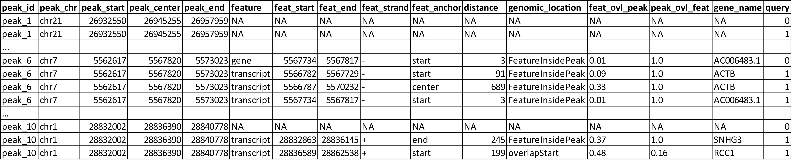
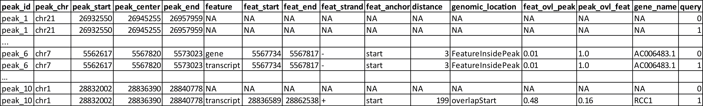
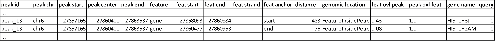
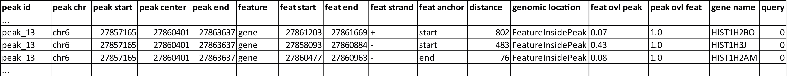
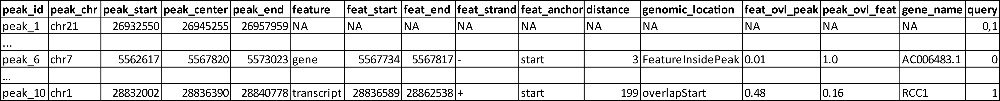
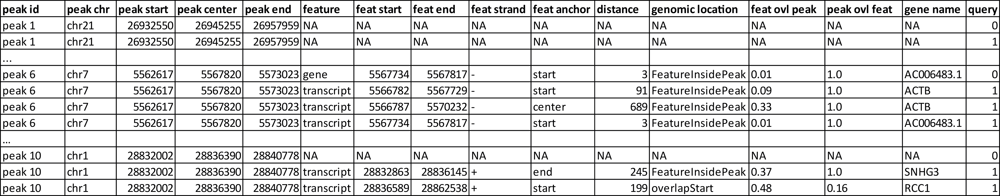
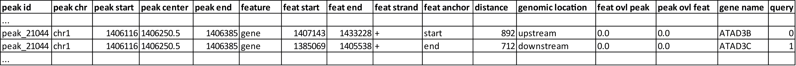

In this section several examples for the usage of the config file are presented. 
A detailed introduction of how to use the config file can be found in the section [Configuration file](http://uropa.readthedocs.io/en/latest/uropa-example/).
There is also a detailed information about the different output formats in the section [Output](http://uropa.readthedocs.io/en/latest/output/).


Example 1: 'feature.anchor' key
-------------------------------
UROPA allows a flexibility of annotation for features. With the key 'feature.anchor' it is possible to decide from where the distance to the peak should be calculated. 
Typically, the distance is calculated from the TSS, correspond to 'start' in UROPA. Furthermore, it is possible to use the 'center' and 'end' of the feature for the distance calculation. 

If no value is given, the distances from all three positions to the peak center are calculated and the closest is choosen. Only if the choosen distance is smaller or equal to the distance defined in the 'distance' key, the peak will be annotated for that feature.                                                                                        The position closer to the peak.center will be indicated in the output file in the column **'feat_anchor'**.

There are two queries with different 'feature.anchor' for this example. 

```json
"queries": [ {"feature":"gene", "distance":5000, "feature.anchor": "start", "show.attributes":"gene_name", },       
		       {"feature": "gene","distance":5000, "feature.anchor": "center"} ]
"priority" : "False"
"gtf": "gencode.v19.annotation.gtf",
"bed": "ENCFF001SUE.bed"
```

As displayed in the output below (Table 1), the peak could only be annotated for query 1 where 'feature.anchor' is set to 'center' and the measured distance is within the accepted cut-off value. 
The location of the gene and the peak of interest (highlighted in black colour) are shown in the Figure 1. The gene *BCL2L13*  is very large, that is why the measurement of distance from 'start' position couldn't return a valid annotation. 
											` feature.start – peak.center = |18111621-18161442| = 49 821 `


	
_Table 1: AllHits with annotation of a peak from two queries with different 'feature.anchor' and 'priority' = 'False'_


_Figure 1: From the histone mark H3K4me1, peak71(chr22:18161387-18161496) annotated with the gene *BCL2L13* from gencode, at a distance 1063bp from feature.center to peak.center_

Concerning the other output tables, 

* FinalHits will only contain the second column with a valid annotation

* BestperQuery_Hits will be the same as the AllHits in this case, because there are no multiple valid annotations for one query.


**Note** : Similar cases of peaks being internally to the genomic region of a feature (and also features being internally to a peak region) 
can be well-annotated using the key 'internals'. A example for this is presented in [TODO](todo).


Example 2: 'direction' key
--------------------------

In the following example the utility of the key 'direction' will be illustrated. It is optional but can be a very important player for a specialized annotation.                  

When the direction key is set to **'upstream'**, peaks will be annotated to a feature if the peak center is upstream of the feature and the distance from the 'feature.anchor' is smaller than the distance required in the config file. The same would be for **'downstream'**  where the location of the peak should be downstream of the gene (Figure 2).

So,the location of the peak is relative to the feature’s direction, and furthermore, the closest 'feature.anchor' is actually the 'start' when peak is upstream, while on the contrary, it is the 'end', if the peak is downstream.  This is why in the example the 'feature.anchor' will be used with default values.

*An overlap of the feature to the start or end of the peak is partially allowed, but the overlap should allow a clear evidence of the upstream or downstream location of the peak.*

{width="50px"}


Figure 2 : Location of a peak shown upstream of the start of a gene. In some cases the 'upstream' direction will be matched with annotation of genomic_location 'overlapStart', the second peak would be an example for this genomic location.
Respectively, if peak found on the right side it would be considered 'downstream' of the gene and the genomic_location would be 'overlapEnd' or 'downstream'.


  

Figure 3: H3K4me1 peak annotated with the Gencode genome, the genomic location is chr1:1,403,500-1,408,500

The peak, the following example is based on is displayed in Figure 3. 
Configuration for the first annotation run:
```json
"queries": [{ "feature": "gene", "attribute":"gene_name", "distance":1000, "direction":"any_direction" }]
"priority" : "False"
"gtf": "gencode.v19.annotation.gtf",
"bed": "ENCFF001SUE.bed"
```

The peak displayed in Figure 3 would be annotated for both genes as shown in the table below:



_Table 2 : AllHits for an H3K4me1 peak annotated for two genes with different directions of the peak_


Due to the fact that no 'feature.anchor' was defined, the distance shown in the table is measured from the closed feature.anchor: 'start' for  *ATAD3B*, 'end' for *ATAD3C* .

In this case, the annotation for gene *ATAD3C* with a distance of 712 bp would be represented in the FinalHits. Due to the knowledge that the peak represents H3K4me1 peaks, biologically it might be more probable to annotate it for *ATAD3B*.
With this kind of estimation of your data, the 'direction' key can be used for a more specialized annotation.
Configuration for the second annotation run:
```json
"queries": [{ "feature": "gene", "attribute":"gene_name", "distance":1000, "direction":"upstream" }]
"priority" : "False"
"gtf": "gencode.v19.annotation.gtf",
"bed": "ENCFF001SUE.bed"
```


In this case the peak will only be annotated for *ATAD3B* , because it is located 'upstream' to it. The annotation for *ATAD3C*  is no longer, even though the distance is closer. 


So, globally, this example shows that more specific annotation can be useful for peaks like this one, in order to obtain a unique feature matching more specific requirements. 
There is interest in cases where for example, some genomic regions are known to be enriched in transcriptionally active promoters, and we would like to know to which features these regions are found upstream. Moreover, a ‘downstream’ direction could be useful for the targeted identification of miRNAs or 3’UTR-binding proteins.


Example 3: 'internals' key
--------------------------
By default the parameter 'internals' is set to 'False'. With this setting, peaks are only annotated with features whose 'distance' is smaller than the defined one in the config.          

But there are cases where the genomic feature is larger than the set 'distance' and this case can lead to unannotated peaks, even if the peak is located inside the genomic feature interval (seen in the Example 1).     
Same the other way around, there exist very large peaks containing small features inside their interval. 
The 'internals' key was implemented exactly for these cases.   

So, peaks with a max distance from the feature are normally annotated with it, but **also** those who contain the feature internally, or are included in the features region. 
These internal features are the only ones allowed to be in a larger distance than the set 'distance'.

Especially, when predicted peaks used for annotation are very small (e.g. ATAc-se peaks) or very large, this option becomes very handy.   
This example is based on the peak displayed in Figure 4. The peak is very large and the region includes three different genes. 


Figure 4: A polR2A-peak annotated with Ensembl, genomic location: chr6 : 27,858,000 - 27,863,000
 
Configuration for the first annotation run:
```json
"queries":[{"feature":"gene", "distance":500, "show.attributes":"gene_name", "internals" : "False"}]
"gtf":"Homo_sapiens.GRCh37.75_chr.gtf" ,
"bed":"ENCFF001VFA.bed"
```



_Table 3 : AllHits with "internals":"False" for the peak_13 of ENCFF001VFA._

As displayed in Table 10, there are two valid annotation for the given configuration. But the third gene in this genomic regions is missed.

Configuration for the second annotation:
 Configuration for the first annotation run:
```json
"queries":[{"feature":"gene", "distance":500, "show.attributes":"gene_name", "internals" : "True"}]
"gtf":"Homo_sapiens.GRCh37.75_chr.gtf" ,
"bed":"ENCFF001VFA.bed"
```



_Table 4: AllHits with "internals":"True" for the peak_13 of ENCFF001VFA._

As displayed in Table 3 there are three genes annotated for the peak. One more valid annotation as without the 'internals' key set True. All of them are located inside of the peak as shown in Figure 4.    
Whether the peak is inside the feature or the feature in the peak is displayed in the genomic_location column of the output files. 

These examples make overally evident, that depending on the biological relevance, it can be very useful to utilize more flexible keys and allow better control of results. 


Example 4: 'filter.attribute' + ' 'attribute.value' keys
---------------------------------------------------------

If the annotation should be more particularized, the linked keys 'filter.attribute' + ' 'attribute.value' can be used. With those it is possible to further restrict the annotation. 
For example, the peaks should not just be annotated genes but protein coding genes. Things like this can be done with the linked keys, for example with the following configuration:

```json
"queries":[{"feature":"gene", "distance":5000, "show.attributes":["gene_name","gene_biotype"],"filter.attribute": "gene_biotype", "attribute.value": "protein_coding" }]
"gtf":"Homo_sapiens.GRCh37.75_chr.gtf" ,
"bed":"ENCFF001VFA.bed"
```

**Attention** : These two keys are dependent to each other, so they must both be given for a proper use of filtering. Additionally, it is just possible to filter for values given in the attribute column. GTF source files can contain different attribute keys and values, so make sure the chosen values are present.

As shown in the AllHits Table 4, the annotated peaks are only for protein coding genes. This is a stricter form of annotation. Of course all other attributes in the annotation file can be used.
Using this keys can be very useful in combination with the 'priority' flag. With setting it 'True' it is possible to prioritize 'protein_coding' genes over 'pseudogenes' etc. 
It is advised to use the 'filter.attribute' key also in 'show.attributes' key, too. With this is is displayed in the output files as well which is useful if several linked keys are represented in the configuration. 



_Table 5 : AllHits for annotation with linked keys 'filter.attribute' + 'attribute.value'_


Example 5: 'priority' flag
-----------------------------

More than one query can be given, keeping the same gtf and bed files, allowing for a combination of annotation in one run.    
If there are more queries, it is important to decide if they should be priorized. This can be done with the priority key in the config file.   
The following examples illustrate how this can be beneficial for the annotation.

The queries in the config file looks like the following.

This example is based on POLR2A peaks annotated with the Ensembl genome. 
Source files can be found here :[gtf and bed source files](http://uropa.readthedocs.io/en/latest/uropa-example/#used-peak-and-annotation-files)

Configuration for the first annotation:
```json
{"queries": [{"feature":"gene", "distance":1000, "show.attributes":"gene_name"},     
			{"feature":"transcript", "distance":1000 }], 
 "priority" : "False",
 "gtf":"Homo_sapiens.GRCh37.75_chr.gtf" ,
 "bed":"ENCFF001VFA.bed"
}
```
	The above set of queries will allow UROPA to annotate peaks for genes and transcripts. As priority is False (default if no different value given),there is no feature priorized. 

	There can be three cases for the peak annotation: 

	* **Case 1**: No query gives any feature for annotating the peaks. 
	
	* **Case 2**: One query gives a feature but the other not. 
	
	* **Case 3**: Both queries validate features overlapping with the peaks.  

		
	
	_Table 6: AllHits for two queries with priority='False'._

	'peak_1' represents **Case 1**  where both queries validate no feature at all. In this case the peak is represented by 'NA' rows, for each query. 
	
	**Case 2** is represented by 'peak_10', which has two annotations for the transcript feature but not the gene feature.       
	
	'peak_6' is an example for the **Case 3** , with annotations for both queries. Transcripts (*ACTB*) are found by query 1 and a gene (*AC006483.1*) by query 0.
	
Concerning the other output tables, 

* FinalHits will contain one NA row for peak_1 combining queries 0 and 1. The final hit for peak_6 will be the the hit for feature gene, distance 3bp. If there are more hits with same min distance for one peak, the first one will be displayed. Fore peak_10 the annotation for gene *RCC1* would be displayed.  

* BestperQuery_Hits contains one NA row for both queries for peak_1. For peak_6 the best annotation for both queries would be represented, those with distance 3bp. The peak_10 will have one NA row for query 0 and the annotation for gene *RCC1* for query 1. 


Configuration for the second annotation:
```json
{"queries": [{"feature":"gene", "distance":1000, "show.attributes":"gene_name"}, {"feature":"transcript", "distance":1000 }], 
 "priority" : "True",
 "gtf":"Homo_sapiens.GRCh37.75_chr.gtf" ,
 "bed":"ENCFF001VFA.bed"
}
```
	If 'priority' is 'True', UROPA will annotate peaks with the **first feature given** in the set of queries. Unless genes are not found for a peak, 'transcripts' will then be searched and validated by the query’s parameters in order to be assigned to a peak. The example is based on the same three cases, explained above.
	That is why there will be no peak in the output tables annotated for both features at the same time. 
	Each peak is allowed to have the 1st feature or the 2nd, or the 3rd, etc.


	The first difference to the example without priority is that in 'AllHits' [Table 4], the peaks with no annotation for both queries are merged in one line and both queries are reported.    
	This is why the entries for peaks without any annotation will look the same in 'AllHits' and 'BestHits'.

	In the case of  'peak_6'  there is an annotation for the priorized query 0, so the other query is not further analyzed. 
	    
	For 'peak_10' there was no annotation identified for the query 0, but two 'transcripts' are found for query-1. The annotation with the closest distance, *SNHG3*  is displayed at the BestHits (Table 5).	
	
	
	
	_Table 7: AllHits with two queries with priority='True'._
	


	**So, in the case of 'priority' = True, the features are mutually exclusive, and the queries are parsed for valid hits in an escalating priority.**        
	
Used peak and annotation files 
------------------------------ 

Annotation:  
Ensembl database of the human genome, version hg19 (GRC37): [Ensembl genome](ftp://ftp.ensembl.org/pub/release-75/gtf/homo_sapiens/)                      
Human Gencode genome, version hg19: [Gencode genome](ftp://ftp.sanger.ac.uk/pub/gencode/Gencode_human/release_19/) 

Peak and signal files based on ChIP-seq of GM12878 immortalized cell line:  
[H3K4ME1](https://www.encodeproject.org/experiments/ENCSR000AKF/)	(accession ENCFF001SUE for bed file)
[POLR2A](https://www.encodeproject.org/experiments/ENCSR000EAD/)	(accession ENCFF001VFA for bed file)

**Note**: peak ids are manually added to make it easier to compare different tables or to combine tables with images. 


>> Still not sure how to use the config file? Please contact Maria Kondili(maria.kondili@mpi-bn.mpg.de)