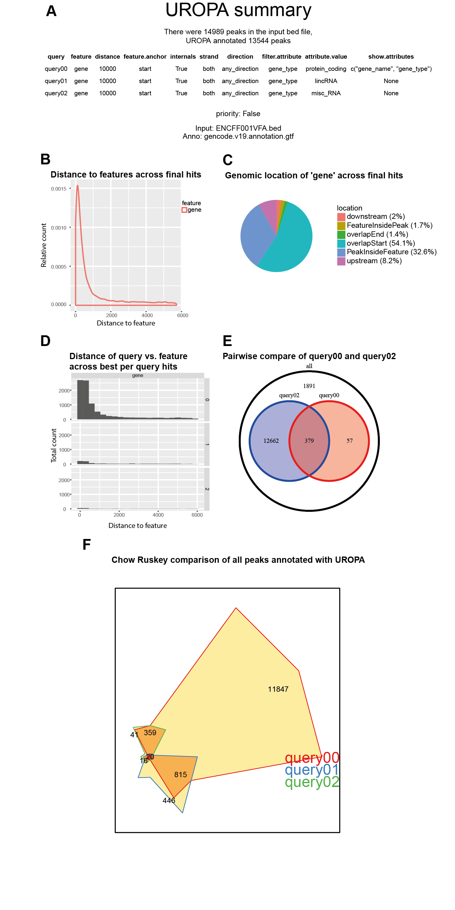

Output tables
=============
UROPA provides multiple output files, each providing valuable information in either a more extended or a more condense way in order to cover the needs of a user.                                          
Details are given below:

File overview
-------------

- **Uropa_AllHits**: Basic output table, reports for each peak all valid annotations and additionally NA rows for peaks without valid annotation.

- **Uropa_FinalHits**: Filtered output table, it reports the best (closest) feature according to the config criteria for each peak. If multiple queries are given, it reports the best annotation taking multiple queries into account.                                              

- **Uropa_BestperQuery_Hits**: This table is only produced if more than one query is given. It reports the best annotation per query for each peak.

- **Uropa_Reformatted_HitsperPeak**: Another format of the BestperQuery Hits produced by using the ``-r`` parameter. A compact table with best per query annotation for each peak in one row is presented. 

- **Uropa_Summary**: Statistical summary of the UROPA annotation by using the ``-s`` parameter.

.. note::
	The output files will be named additionally by the output directory name. 
	For example if uropa is used like this:	``uropa.py -i config.json -o ChIPanno``
	
	The result would contain: ChIPannot/Uropa_AllHits_ChIPannot.txt

Output columns explanation
--------------------------

The four output tables mentioned above contain informative columns about the performed peak annotation:

- **peak_id, peak_start, peak_center, peak_end, peak_strand**: Peak information with id if available, otherwise a peak id in chr:start-end format will be created.

- **feature, feat_start, feat_end, feat_strand**: The information of the genomic feature that annotates the peak as extracted by the GTF file.

- **feat_anchor**: The position of the annotated genomic feature which was used for distance calculation. If ``feature.anchor`` is given in config, only this will be used.                                    If multiple ``feature.anchor`` were given, the distance to all of them is calculated and the minimum distance is chosen.

- **distance** : Absolute distance from peak center to feature anchor. Closest feature anchor if multiple are specified, see column feat_anchor.

- **genomic_location**: The position of the peak relative to the annotated feature direction (e.g. upstream = peak located upstream of the feature, see Figure 2 in :doc:`/uropa-example`).

- **feat_ovl_peak**: Percentage of the peak that is covered by the feature (1.0 = 100%, this corresponds to the genomic_location "PeakInsideFeature").

- **peak_ovl_feat**: Percentage of the feature that is covered by the peak (1.0 corresponds to the genomic_location "FeatureInsidePeak").

- **gene_name, gene_id, gene_type,...**: Attributes that have been given in the key ``show.atttributes`` with their values extracted from the GTF.

.. hint:: 
	- If ``filter.attribute`` key is used, make sure to specify these attributes are also selected in the ``show.attributes`` key, to have an easy confirmation of the filtering.
	- Make sure to define attributes for a notification in the output. Otherwise the annotated peaks will be reported without any information of the assigned features.

- **query**: Valid query ID for the current annotation (0-based).

Output files (one query)
------------------------
UROPA annotation with one query results in two output tables. Those are the Uropa_AllHits and Uropa_FinalHits. 
For a configuration as given below, the AllHits is given in Table 1, and the FinalHits is displayed in Table 2. 
Peak and annotation files are further described in the :doc:`/uropa-example` section. 

The UROPA annotation process for one query can run into three cases for each peak:

- **Case 1**: No query gives any feature for annotating the peak, this leads to no valid annotation at all -> NA row in AllHits and FinalHits. 
	
- **Case 2**: There is one valid annotation for the specified query -> annotation will be given in AllHits and FinalHits. 
	
- **Case 3**: There are multiple valid annotations for the specified query -> all valid annotations will be given in the AllHits, the best annotation (smallest distance) will be presented in the FinalHits.  

.. code:: json

    {
    "queries":[
            {"feature":"gene", "distance":10000, "feature.anchor":"start", "internals":"True", 
                "filter.attribute":"gene_type", "attribute.value":"protein_coding",
                "show.attributes":["gene_name","gene_type"]}], 
     "priority" : "False",
     "gtf":"gencode.v19.annotation.gtf" ,
     "bed":"ENCFF001VFA.bed"
    }
	
+----------+----------+------------+-------------+------------+-------------+---------+------------+-------------+-------------+-------------+----------+-------------------+---------------+---------------+-----------+----------------+-------+
| peak_id  | peak_chr | peak_start | peak_center | peak_end   | peak_strand | feature | feat_start | feature_end | feat_strand | feat_anchor | distance | genomic_location  | feat_ovl_peak | peak_ovl_feat | gene_name | gene_type      | query |
+==========+==========+============+=============+============+=============+=========+============+=============+=============+=============+==========+===================+===============+===============+===========+================+=======+
| …        |          |            |             |            |             |         |            |             |             |             |          |                   |               |               |           |                |       |
+----------+----------+------------+-------------+------------+-------------+---------+------------+-------------+-------------+-------------+----------+-------------------+---------------+---------------+-----------+----------------+-------+
| peak_355 | chr15    | 79211550   | 79217124    | 79222698   | .           | NA      | NA         | NA          | NA          | NA          | NA       | NA                | NA            | NA            | NA        | NA             | 0     |
+----------+----------+------------+-------------+------------+-------------+---------+------------+-------------+-------------+-------------+----------+-------------------+---------------+---------------+-----------+----------------+-------+
| peak_356 | chr10    | 43902516   | 43904360.5  | 43906205   | .           | gene    | 43881065   | 43904614    | \-          | start       | 253      | overlapStart      | 0.57          | 0.09          | HNRNPF    | protein_coding | 0     |
+----------+----------+------------+-------------+------------+-------------+---------+------------+-------------+-------------+-------------+----------+-------------------+---------------+---------------+-----------+----------------+-------+
| …        |          |            |             |            |             |         |            |             |             |             |          |                   |               |               |           |                |       |
+----------+----------+------------+-------------+------------+-------------+---------+------------+-------------+-------------+-------------+----------+-------------------+---------------+---------------+-----------+----------------+-------+
| peak_765 | chr5     | 98262863   | 98264852.5  | 98266842   | .           | gene    | 98190908   | 98262240    | \-          | start       | 261      | upstream          | 0.0           | 0.0           | CHD1      | protein_coding | 0     |
+----------+----------+------------+-------------+------------+-------------+---------+------------+-------------+-------------+-------------+----------+-------------------+---------------+---------------+-----------+----------------+-------+
| …        |          |            |             |            |             |         |            |             |             |             |          |                   |               |               |           |                |       |
+----------+----------+------------+-------------+------------+-------------+---------+------------+-------------+-------------+-------------+----------+-------------------+---------------+---------------+-----------+----------------+-------+
| peak_769 | chr5     | 175814508  | 175816913.5 | 1751574319 | .           | gene    | 175810949  | 175815976   | \+          | start       | 937      | overlapStart      | 0.31          | 0.3           | NOP16     | protein_coding | 0     |
+----------+----------+------------+-------------+------------+-------------+---------+------------+-------------+-------------+-------------+----------+-------------------+---------------+---------------+-----------+----------------+-------+
| peak_769 | chr5     | 175814508  | 175816913.5 | 1751574319 | .           | gene    | 175815748  | 175816772   | \+          | start       | 1165     | FeatureInsidePeak | 0.22          | 1.0           | HIGD2A    | protein_coding | 0     |
+----------+----------+------------+-------------+------------+-------------+---------+------------+-------------+-------------+-------------+----------+-------------------+---------------+---------------+-----------+----------------+-------+
| peak_769 | chr5     | 175814508  | 175816913.5 | 1751574319 | .           | gene    | 175792471  | 175828666   | \+          | start       | 24442    | PeakInsideFeature | 1.0           | 0.14          | ARL10     | protein_coding | 0     |
+----------+----------+------------+-------------+------------+-------------+---------+------------+-------------+-------------+-------------+----------+-------------------+---------------+---------------+-----------+----------------+-------+
| …        |          |            |             |            |             |         |            |             |             |             |          |                   |               |               |           |                |       |
+----------+----------+------------+-------------+------------+-------------+---------+------------+-------------+-------------+-------------+----------+-------------------+---------------+---------------+-----------+----------------+-------+

**Table 5.1:**  Excerpt of table AllHits for one query as described in the configuration above.

+----------+----------+------------+-------------+------------+-------------+---------+------------+-------------+-------------+-------------+----------+-------------------+---------------+---------------+-----------+----------------+-------+
| peak_id  | peak_chr | peak_start | peak_center | peak_end   | peak_strand | feature | feat_start | feature_end | feat_strand | feat_anchor | distance | genomic_location  | feat_ovl_peak | peak_ovl_feat | gene_name | gene_type      | query |
+==========+==========+============+=============+============+=============+=========+============+=============+=============+=============+==========+===================+===============+===============+===========+================+=======+
| …        |          |            |             |            |             |         |            |             |             |             |          |                   |               |               |           |                |       |
+----------+----------+------------+-------------+------------+-------------+---------+------------+-------------+-------------+-------------+----------+-------------------+---------------+---------------+-----------+----------------+-------+
| peak_355 | chr15    | 79211550   | 79217124    | 79222698   | .           | NA      | NA         | NA          | NA          | NA          | NA       | NA                | NA            | NA            | NA        | NA             | 0     |
+----------+----------+------------+-------------+------------+-------------+---------+------------+-------------+-------------+-------------+----------+-------------------+---------------+---------------+-----------+----------------+-------+
| peak_356 | chr10    | 43902516   | 43904360.5  | 43906205   | .           | gene    | 43881065   | 43904614    | \-          | start       | 253      | overlapStart      | 0.57          | 0.09          | HNRNPF    | protein_coding | 0     |
+----------+----------+------------+-------------+------------+-------------+---------+------------+-------------+-------------+-------------+----------+-------------------+---------------+---------------+-----------+----------------+-------+
| …        |          |            |             |            |             |         |            |             |             |             |          |                   |               |               |           |                |       |
+----------+----------+------------+-------------+------------+-------------+---------+------------+-------------+-------------+-------------+----------+-------------------+---------------+---------------+-----------+----------------+-------+
| peak_765 | chr5     | 98262863   | 98264852.5  | 98266842   | .           | gene    | 98190908   | 98262240    | \-          | start       | 261      | upstream          | 0.0           | 0.0           | CHD1      | protein_coding | 0     |
+----------+----------+------------+-------------+------------+-------------+---------+------------+-------------+-------------+-------------+----------+-------------------+---------------+---------------+-----------+----------------+-------+
| …        |          |            |             |            |             |         |            |             |             |             |          |                   |               |               |           |                |       |
+----------+----------+------------+-------------+------------+-------------+---------+------------+-------------+-------------+-------------+----------+-------------------+---------------+---------------+-----------+----------------+-------+
| peak_769 | chr5     | 175814508  | 175816913.5 | 1751574319 | .           | gene    | 175810949  | 175815976   | \+          | start       | 937      | overlapStart      | 0.31          | 0.3           | NOP16     | protein_coding | 0     |
+----------+----------+------------+-------------+------------+-------------+---------+------------+-------------+-------------+-------------+----------+-------------------+---------------+---------------+-----------+----------------+-------+
| …        |          |            |             |            |             |         |            |             |             |             |          |                   |               |               |           |                |       |
+----------+----------+------------+-------------+------------+-------------+---------+------------+-------------+-------------+-------------+----------+-------------------+---------------+---------------+-----------+----------------+-------+

**Table 5.2:**  Excerpt of table FinalHits for one query as described in the configuration above.

As displayed in Table 1 and Table 2, peak 355 is a representative of Case 1. There is no valid annotation at all, thus there is an NA row in both output tables. 

The peaks 356 and 765 belong to Case 2, there is one valid annotation for them, their annotation is displayed in the same way in AllHits and FinalHits. 

Peak 769 has three valid annotations for the specified query (Case 3). All of them are displayed in the AllHits output. 
In the FinalHits only the best annotation, the one for gene NOP16 with the minimal distance of 937, is represented.

Output files (multiple queries)
--------------------------------
UROPA annotation with multiple queries and default priority results in at least three output tables. 
Those are the Uropa_AllHits, Uropa_FinalHits, and Uropa_BestperQuery_Hits. 
If the ``-r`` parameter is added in the command line call, there will the additional output Uropa_Reformatted_HitsperPeak file.
Furthermore, if the ``-s`` parameter is also added, the Uropa_Summary file is generated.              
With a configuration as given below, the generated output files are generated as presented in Tables 3 to 6 and Figure 1. 

Peak and annotation files are further described in the :doc:`/uropa-example` section.       

The UROPA annotation process for multiple queries allows an additional case in relation to the cases described for one query above:

- **Case 1 to 3** as described for one query

- **Case 4**: There are valid annotations for one peak for multiple queries -> all valid annotations will be given in the AllHits, the best annotation (smallest distance across all queries) will be presented in the FinalHits. 
Additionally, the best annotation per query will be displayed in the BestperQuery_Hits output.

.. code:: json

    {
	"queries":[
            {"feature":"gene", "distance":10000, "feature.anchor":"start", "internals":"True", 
                "filter.attribute":"gene_type",  "attribute.value":"protein_coding",
                "show.attributes":["gene_name","gene_type"]},
            {"feature":"gene", "distance":10000, "feature.anchor":"start", "internals":"True", 
                "filter.attribute":"gene_type",  "attribute.value":"lincRNA"},
            {"feature":"gene", "distance":10000, "feature.anchor":"start", "internals":"True", 
                "filter.attribute":"gene_type",  "attribute.value":"misc_RNA"},
              ],
    "priority" : "False",
    "gtf": "gencode.v19.annotation.gtf",
    "bed": "ENCFF001VFA.peaks.bed"
    }

	
+----------+----------+------------+-------------+------------+-------------+---------+------------+-------------+-------------+-------------+----------+-------------------+---------------+---------------+---------------+----------------+-------+
| peak_id  | peak_chr | peak_start | peak_center | peak_end   | peak_strand | feature | feat_start | feature_end | feat_strand | feat_anchor | distance | genomic_location  | feat_ovl_peak | peak_ovl_feat | gene_name     | gene_type      | query |
+==========+==========+============+=============+============+=============+=========+============+=============+=============+=============+==========+===================+===============+===============+===============+================+=======+
| …        |          |            |             |            |             |         |            |             |             |             |          |                   |               |               |               |                |       |
+----------+----------+------------+-------------+------------+-------------+---------+------------+-------------+-------------+-------------+----------+-------------------+---------------+---------------+---------------+----------------+-------+
| peak_355 | chr15    | 79211550   | 79217124    | 79222698   | .           | NA      | NA         | NA          | NA          | NA          | NA       | NA                | NA            | NA            | NA            | NA             | 0     |
+----------+----------+------------+-------------+------------+-------------+---------+------------+-------------+-------------+-------------+----------+-------------------+---------------+---------------+---------------+----------------+-------+
| peak_355 | chr15    | 79211550   | 79217124    | 79222698   | .           | NA      | NA         | NA          | NA          | NA          | NA       | NA                | NA            | NA            | NA            | NA             | 1     |
+----------+----------+------------+-------------+------------+-------------+---------+------------+-------------+-------------+-------------+----------+-------------------+---------------+---------------+---------------+----------------+-------+
| peak_355 | chr15    | 79211550   | 79217124    | 79222698   | .           | NA      | NA         | NA          | NA          | NA          | NA       | NA                | NA            | NA            | NA            | NA             | 2     |
+----------+----------+------------+-------------+------------+-------------+---------+------------+-------------+-------------+-------------+----------+-------------------+---------------+---------------+---------------+----------------+-------+
| peak_356 | chr10    | 43902516   | 43904360.5  | 43906205   | .           | gene    | 43881065   | 43904614    | \-          | start       | 253      | overlapStart      | 0.57          | 0.09          | HNRNPF        | protein_coding | 0     |
+----------+----------+------------+-------------+------------+-------------+---------+------------+-------------+-------------+-------------+----------+-------------------+---------------+---------------+---------------+----------------+-------+
| peak_356 | chr10    | 43902516   | 43904360.5  | 43906205   | .           | NA      | NA         | NA          | NA          | NA          | NA       | NA                | NA            | NA            | NA            | NA             | 1     |
+----------+----------+------------+-------------+------------+-------------+---------+------------+-------------+-------------+-------------+----------+-------------------+---------------+---------------+---------------+----------------+-------+
| peak_356 | chr10    | 43902516   | 43904360.5  | 43906205   | .           | NA      | NA         | NA          | NA          | NA          | NA       | NA                | NA            | NA            | NA            | NA             | 2     |
+----------+----------+------------+-------------+------------+-------------+---------+------------+-------------+-------------+-------------+----------+-------------------+---------------+---------------+---------------+----------------+-------+
| …        |          |            |             |            |             |         |            |             |             |             |          |                   |               |               |               |                |       |
+----------+----------+------------+-------------+------------+-------------+---------+------------+-------------+-------------+-------------+----------+-------------------+---------------+---------------+---------------+----------------+-------+
| peak_765 | chr5     | 98262863   | 98264852.5  | 98266842   | .           | gene    | 98190908   | 98262240    | \-          | start       | 261      | upstream          | 0.0           | 0.0           | CHD1          | protein_coding | 0     |
+----------+----------+------------+-------------+------------+-------------+---------+------------+-------------+-------------+-------------+----------+-------------------+---------------+---------------+---------------+----------------+-------+
| peak_765 | chr5     | 98262863   | 98264852.5  | 98266842   | .           | gene    | 98264875   | 98330717    | \+          | start       | 22       | overlapStart      | 0.5           | 0.03          | CTD-2007H13.3 | protein_coding | 1     |
+----------+----------+------------+-------------+------------+-------------+---------+------------+-------------+-------------+-------------+----------+-------------------+---------------+---------------+---------------+----------------+-------+
| peak_765 | chr5     | 98262863   | 98264852.5  | 98266842   | .           | gene    | 98272342   | 98272451    | \-          | start       | 7598     | downstream        | 0.0           | 0.0           | Y_RNA         | protein_coding | 2     |
+----------+----------+------------+-------------+------------+-------------+---------+------------+-------------+-------------+-------------+----------+-------------------+---------------+---------------+---------------+----------------+-------+
| …        |          |            |             |            |             |         |            |             |             |             |          |                   |               |               |               |                |       |
+----------+----------+------------+-------------+------------+-------------+---------+------------+-------------+-------------+-------------+----------+-------------------+---------------+---------------+---------------+----------------+-------+
| peak_769 | chr5     | 175814508  | 175816913.5 | 1751574319 | .           | gene    | 175810949  | 175815976   | \+          | start       | 937      | overlapStart      | 0.31          | 0.3           | NOP16         | protein_coding | 0     |
+----------+----------+------------+-------------+------------+-------------+---------+------------+-------------+-------------+-------------+----------+-------------------+---------------+---------------+---------------+----------------+-------+
| peak_769 | chr5     | 175814508  | 175816913.5 | 1751574319 | .           | gene    | 175815748  | 175816772   | \+          | start       | 1165     | FeatureInsidePeak | 0.22          | 1.0           | HIGD2A        | protein_coding | 0     |
+----------+----------+------------+-------------+------------+-------------+---------+------------+-------------+-------------+-------------+----------+-------------------+---------------+---------------+---------------+----------------+-------+
| peak_769 | chr5     | 175814508  | 175816913.5 | 1751574319 | .           | gene    | 175792471  | 175828666   | \+          | start       | 24442    | PeakInsideFeature | 1.0           | 0.14          | ARL10         | protein_coding | 0     |
+----------+----------+------------+-------------+------------+-------------+---------+------------+-------------+-------------+-------------+----------+-------------------+---------------+---------------+---------------+----------------+-------+
| peak_769 | chr5     | 175814508  | 175816913.5 | 1751574319 | .           | NA      | NA         | NA          | NA          | NA          | NA       | NA                | NA            | NA            | NA            | NA             | 1     |
+----------+----------+------------+-------------+------------+-------------+---------+------------+-------------+-------------+-------------+----------+-------------------+---------------+---------------+---------------+----------------+-------+
| peak_769 | chr5     | 175814508  | 175816913.5 | 1751574319 | .           | NA      | NA         | NA          | NA          | NA          | NA       | NA                | NA            | NA            | NA            | NA             | 2     |
+----------+----------+------------+-------------+------------+-------------+---------+------------+-------------+-------------+-------------+----------+-------------------+---------------+---------------+---------------+----------------+-------+
| …        |          |            |             |            |             |         |            |             |             |             |          |                   |               |               |               |                |       |
+----------+----------+------------+-------------+------------+-------------+---------+------------+-------------+-------------+-------------+----------+-------------------+---------------+---------------+---------------+----------------+-------+
	
**Table 5.3:**  Excerpt of table AllHits for three queries as described in the configuration above.
 
+----------+----------+------------+-------------+------------+-------------+---------+------------+-------------+-------------+-------------+----------+-------------------+---------------+---------------+---------------+----------------+-------+
| peak_id  | peak_chr | peak_start | peak_center | peak_end   | peak_strand | feature | feat_start | feature_end | feat_strand | feat_anchor | distance | genomic_location  | feat_ovl_peak | peak_ovl_feat | gene_name     | gene_type      | query |
+==========+==========+============+=============+============+=============+=========+============+=============+=============+=============+==========+===================+===============+===============+===============+================+=======+
| …        |          |            |             |            |             |         |            |             |             |             |          |                   |               |               |               |                |       |
+----------+----------+------------+-------------+------------+-------------+---------+------------+-------------+-------------+-------------+----------+-------------------+---------------+---------------+---------------+----------------+-------+
| peak_355 | chr15    | 79211550   | 79217124    | 79222698   | .           | NA      | NA         | NA          | NA          | NA          | NA       | NA                | NA            | NA            | NA            | NA             | 0,1,2 |
+----------+----------+------------+-------------+------------+-------------+---------+------------+-------------+-------------+-------------+----------+-------------------+---------------+---------------+---------------+----------------+-------+
| peak_356 | chr10    | 43902516   | 43904360.5  | 43906205   | .           | gene    | 43881065   | 43904614    | \-          | start       | 253      | overlapStart      | 0.57          | 0.09          | HNRNPF        | protein_coding | 0     |
+----------+----------+------------+-------------+------------+-------------+---------+------------+-------------+-------------+-------------+----------+-------------------+---------------+---------------+---------------+----------------+-------+
| …        |          |            |             |            |             |         |            |             |             |             |          |                   |               |               |               |                |       |
+----------+----------+------------+-------------+------------+-------------+---------+------------+-------------+-------------+-------------+----------+-------------------+---------------+---------------+---------------+----------------+-------+
| peak_765 | chr5     | 98262863   | 98264852.5  | 98266842   | .           | gene    | 98264875   | 98330717    | \-          | start       | 22      | overlapStart       | 0.5           | 0.03          | CTD-2007H13.3 | protein_coding | 1     |
+----------+----------+------------+-------------+------------+-------------+---------+------------+-------------+-------------+-------------+----------+-------------------+---------------+---------------+---------------+----------------+-------+
| …        |          |            |             |            |             |         |            |             |             |             |          |                   |               |               |               |                |       |
+----------+----------+------------+-------------+------------+-------------+---------+------------+-------------+-------------+-------------+----------+-------------------+---------------+---------------+---------------+----------------+-------+
| peak_769 | chr5     | 175814508  | 175816913.5 | 1751574319 | .           | gene    | 175810949  | 175815976   | \+          | start       | 937      | overlapStart      | 0.31          | 0.3           | NOP16         | protein_coding | 0     |
+----------+----------+------------+-------------+------------+-------------+---------+------------+-------------+-------------+-------------+----------+-------------------+---------------+---------------+---------------+----------------+-------+
| …        |          |            |             |            |             |         |            |             |             |             |          |                   |               |               |               |                |       |
+----------+----------+------------+-------------+------------+-------------+---------+------------+-------------+-------------+-------------+----------+-------------------+---------------+---------------+---------------+----------------+-------+
 
**Table 5.4:**  Excerpt of table FinalHits for three queries as described in the configuration above.

+----------+----------+------------+-------------+------------+-------------+---------+------------+-------------+-------------+-------------+----------+-------------------+---------------+---------------+---------------+----------------+-------+
| peak_id  | peak_chr | peak_start | peak_center | peak_end   | peak_strand | feature | feat_start | feature_end | feat_strand | feat_anchor | distance | genomic_location  | feat_ovl_peak | peak_ovl_feat | gene_name     | gene_type      | query |
+==========+==========+============+=============+============+=============+=========+============+=============+=============+=============+==========+===================+===============+===============+===============+================+=======+
| …        |          |            |             |            |             |         |            |             |             |             |          |                   |               |               |               |                |       |
+----------+----------+------------+-------------+------------+-------------+---------+------------+-------------+-------------+-------------+----------+-------------------+---------------+---------------+---------------+----------------+-------+
| peak_355 | chr15    | 79211550   | 79217124    | 79222698   | .           | NA      | NA         | NA          | NA          | NA          | NA       | NA                | NA            | NA            | NA            | NA             | 0     |
+----------+----------+------------+-------------+------------+-------------+---------+------------+-------------+-------------+-------------+----------+-------------------+---------------+---------------+---------------+----------------+-------+
| peak_355 | chr15    | 79211550   | 79217124    | 79222698   | .           | NA      | NA         | NA          | NA          | NA          | NA       | NA                | NA            | NA            | NA            | NA             | 1     |
+----------+----------+------------+-------------+------------+-------------+---------+------------+-------------+-------------+-------------+----------+-------------------+---------------+---------------+---------------+----------------+-------+
| peak_355 | chr15    | 79211550   | 79217124    | 79222698   | .           | NA      | NA         | NA          | NA          | NA          | NA       | NA                | NA            | NA            | NA            | NA             | 2     |
+----------+----------+------------+-------------+------------+-------------+---------+------------+-------------+-------------+-------------+----------+-------------------+---------------+---------------+---------------+----------------+-------+
| peak_356 | chr10    | 43902516   | 43904360.5  | 43906205   | .           | gene    | 43881065   | 43904614    | \-          | start       | 253      | overlapStart      | 0.57          | 0.09          | HNRNPF        | protein_coding | 0     |
+----------+----------+------------+-------------+------------+-------------+---------+------------+-------------+-------------+-------------+----------+-------------------+---------------+---------------+---------------+----------------+-------+
| peak_356 | chr10    | 43902516   | 43904360.5  | 43906205   | .           | NA      | NA         | NA          | NA          | NA          | NA       | NA                | NA            | NA            | NA            | NA             | 1     |
+----------+----------+------------+-------------+------------+-------------+---------+------------+-------------+-------------+-------------+----------+-------------------+---------------+---------------+---------------+----------------+-------+
| peak_356 | chr10    | 43902516   | 43904360.5  | 43906205   | .           | NA      | NA         | NA          | NA          | NA          | NA       | NA                | NA            | NA            | NA            | NA             | 2     |
+----------+----------+------------+-------------+------------+-------------+---------+------------+-------------+-------------+-------------+----------+-------------------+---------------+---------------+---------------+----------------+-------+
| …        |          |            |             |            |             |         |            |             |             |             |          |                   |               |               |               |                |       |
+----------+----------+------------+-------------+------------+-------------+---------+------------+-------------+-------------+-------------+----------+-------------------+---------------+---------------+---------------+----------------+-------+
| peak_765 | chr5     | 98262863   | 98264852.5  | 98266842   | .           | gene    | 98190908   | 98262240    | \-          | start       | 261      | upstream          | 0.0           | 0.0           | CHD1          | protein_coding | 0     |
+----------+----------+------------+-------------+------------+-------------+---------+------------+-------------+-------------+-------------+----------+-------------------+---------------+---------------+---------------+----------------+-------+
| peak_765 | chr5     | 98262863   | 98264852.5  | 98266842   | .           | gene    | 98264875   | 98330717    | \+          | start       | 22       | overlapStart      | 0.5           | 0.03          | CTD-2007H13.3 | protein_coding | 1     |
+----------+----------+------------+-------------+------------+-------------+---------+------------+-------------+-------------+-------------+----------+-------------------+---------------+---------------+---------------+----------------+-------+
| peak_765 | chr5     | 98262863   | 98264852.5  | 98266842   | .           | gene    | 98272342   | 98272451    | \-          | start       | 7598     | downstream        | 0.0           | 0.0           | Y_RNA         | protein_coding | 2     |
+----------+----------+------------+-------------+------------+-------------+---------+------------+-------------+-------------+-------------+----------+-------------------+---------------+---------------+---------------+----------------+-------+
| …        |          |            |             |            |             |         |            |             |             |             |          |                   |               |               |               |                |       |
+----------+----------+------------+-------------+------------+-------------+---------+------------+-------------+-------------+-------------+----------+-------------------+---------------+---------------+---------------+----------------+-------+
| peak_769 | chr5     | 175814508  | 175816913.5 | 1751574319 | .           | gene    | 175810949  | 175815976   | \+          | start       | 937      | overlapStart      | 0.31          | 0.3           | NOP16         | protein_coding | 0     |
+----------+----------+------------+-------------+------------+-------------+---------+------------+-------------+-------------+-------------+----------+-------------------+---------------+---------------+---------------+----------------+-------+
| peak_769 | chr5     | 175814508  | 175816913.5 | 1751574319 | .           | NA      | NA         | NA          | NA          | NA          | NA       | NA                | NA            | NA            | NA            | NA             | 1     |
+----------+----------+------------+-------------+------------+-------------+---------+------------+-------------+-------------+-------------+----------+-------------------+---------------+---------------+---------------+----------------+-------+
| peak_769 | chr5     | 175814508  | 175816913.5 | 1751574319 | .           | NA      | NA         | NA          | NA          | NA          | NA       | NA                | NA            | NA            | NA            | NA             | 2     |
+----------+----------+------------+-------------+------------+-------------+---------+------------+-------------+-------------+-------------+----------+-------------------+---------------+---------------+---------------+----------------+-------+
| …        |          |            |             |            |             |         |            |             |             |             |          |                   |               |               |               |                |       |
+----------+----------+------------+-------------+------------+-------------+---------+------------+-------------+-------------+-------------+----------+-------------------+---------------+---------------+---------------+----------------+-------+

**Table 5.5:**  Excerpt of table BestperQuery_Hits for three queries as described in the configuration above.

.. note:: 
	The BestperQuery_Hits is only generated if multiple queries are specified and the priority flag is set to FALSE! If this flag is TRUE, there will be only one valid query. There can be multiple valid annotations for one peak, but all based on one query. In this case only the AllHits and FinalHits are produced.

Same as in the first example with one query, peak_355 has no valid annotation and is represented as NA row (correspond to Case 1). 
In the AllHits (Table 3) and BestperQuery_Hits (Table 5) there will be one NA row for each query. In the FinalHits (Table 4) there will be only one NA row for all queries. 

The peak_356 has only for one query a valid annotation, as given in AllHits, FinalHits, and BestperQuery_Hits (Case 2). In AllHits and BestperQuery_Hits there are additional NA rows for this peak for the other queries without a hit. 

For peak_765 there are valid annotations for all given queries as displayed in the AllHits, (Case 4). The best of these is the annotation for the lincRNA, therefore this annotation is displayed in the FinalHits. 
Because there is only one valid annotation for each query, they will be displayed in the same way in the BestperQuery_Hits. 

This is different for peak_769. As described above this peaks equates to Case 3. With multiple queries, there will be additional NA rows for the invalid queries in the AllHits and BestperQuery_Hits. 

With multiple queries UROPA provides an option to reformat the BestperQuery_Hits table in order to condense the best per query annotations for each peak in one row.
A reformatted example for the BestperQuery_Hits of Table 5 is presented in Tables 6. 
The Reformatted_HitsperPeak represents all information for each peak in one row. Within this format the information for query 0 is always given at the first position, for query 1 at second positon etc.

To receive this output format, the parameter ``-r`` has to be added to the command line call.

+----------+----------+------------+-------------+------------+-------------+----------------+----------------------------+----------------------------+-------------+-------------------+-------------+----------------------------------+---------------+---------------+--------------------------+----------------------------------------------+-------+
| peak_id  | peak_chr | peak_start | peak_center | peak_end   | peak_strand | feature        | feat_start                 | feature_end                | feat_strand | feat_anchor       | distance    | genomic_location                 | feat_ovl_peak | peak_ovl_feat | gene_name                | gene_type                                    | query |
+==========+==========+============+=============+============+=============+================+============================+============================+=============+===================+=============+==================================+===============+===============+==========================+==============================================+=======+
| …        |          |            |             |            |             |                |                            |                            |             |                   |             |                                  |               |               |                          |                                              |       |
+----------+----------+------------+-------------+------------+-------------+----------------+----------------------------+----------------------------+-------------+-------------------+-------------+----------------------------------+---------------+---------------+--------------------------+----------------------------------------------+-------+
| peak_355 | chr15    | 79211550   | 79217124    | 79222698   | .           | NA,NA,NA       | NA,NA,NA                   | NA,NA,NA                   | NA,NA,NA    | NA,NA,NA          | NA,NA,NA    | NA,NA,NA                         | NA,NA,NA      | NA,NA,NA      | NA,NA,NA                 | NA,NA,NA                                     | 0,1,2 |
+----------+----------+------------+-------------+------------+-------------+----------------+----------------------------+----------------------------+-------------+-------------------+-------------+----------------------------------+---------------+---------------+--------------------------+----------------------------------------------+-------+
| peak_356 | chr10    | 43902516   | 43904360.5  | 43906205   | .           | gene,NA,NA     | 43881065,NA,NA             | 43904614,NA,NA             | \-,NA,NA    | start,NA,NA       | 253,NA,NA   | overlapStart,NA,NA               | 0.57,NA,NA    | 0.09,NA,NA    | HNRNPF,NA,NA             | protein_coding,NA,NA                         | 0,1,2 |
+----------+----------+------------+-------------+------------+-------------+----------------+----------------------------+----------------------------+-------------+-------------------+-------------+----------------------------------+---------------+---------------+--------------------------+----------------------------------------------+-------+
| …        |          |            |             |            |             |                |                            |                            |             |                   |             |                                  |               |               |                          |                                              |       |
+----------+----------+------------+-------------+------------+-------------+----------------+----------------------------+----------------------------+-------------+-------------------+-------------+----------------------------------+---------------+---------------+--------------------------+----------------------------------------------+-------+
| peak_765 | chr5     | 98262863   | 98264852.5  | 98266842   | .           | gene,gene,gene | 98190908,98264875,98272342 | 98262240,98330717,98272451 | \-,\+,\-    | start,start,start | 261,22,7598 | upstream,overlapStart,downstream | 0.0,0.5,0.0   | 0.0,0.03,0.0  | CHD1,CTD-2007H13.3,Y_RNA | protein_coding,protein_coding,protein_coding | 0,1,2 |
+----------+----------+------------+-------------+------------+-------------+----------------+----------------------------+----------------------------+-------------+-------------------+-------------+----------------------------------+---------------+---------------+--------------------------+----------------------------------------------+-------+
| …        |          |            |             |            |             |                |                            |                            |             |                   |             |                                  |               |               |                          |                                              |       |
+----------+----------+------------+-------------+------------+-------------+----------------+----------------------------+----------------------------+-------------+-------------------+-------------+----------------------------------+---------------+---------------+--------------------------+----------------------------------------------+-------+
| peak_769 | chr5     | 175814508  | 175816913.5 | 1751574319 | .           | gene,NA,NA     | 175810949,NA,NA            | 175815976,NA,NA            | \+,NA,NA    | start,NA,NA       | 937,NA,NA   | overlapStart,NA,NA               | 0.31,NA,NA    | 0.3,NA,NA     | NOP16                    | protein_coding                               | 0,1,2 |
+----------+----------+------------+-------------+------------+-------------+----------------+----------------------------+----------------------------+-------------+-------------------+-------------+----------------------------------+---------------+---------------+--------------------------+----------------------------------------------+-------+
| …        |          |            |             |            |             |                |                            |                            |             |                   |             |                                  |               |               |                          |                                              |       |
+----------+----------+------------+-------------+------------+-------------+----------------+----------------------------+----------------------------+-------------+-------------------+-------------+----------------------------------+---------------+---------------+--------------------------+----------------------------------------------+-------+

**Table 5.6:**  Excerpt of table Reformatted_HitsperPeak for three queries as described in the configuration above.

Summary Visualisation
---------------------
In order to generate a global summary, one can apply the ``-s`` parameter during the command line call. 
This summary is visualising a global overview of the generated UROPA annotations, and several usefull plots, 
like the distribution of the annotated peaks to the features of interst and the genomic locations according to the features of interest.
Detailed information about the different plots and how they are dedicated to the different output file formats is explained below.  

**Overview of what can be found in the summary visualsation** 

- An abstract of the UROPA annotation including the used peak and annotation files
- Number of peaks and number of annotated peaks
- Specified queries, and value of the priority flag (Figure 1A)
- Number of peaks per query

**Graphs based on the 'FinalHits' output:**

- Density plot displaying the distance per feature across all queries (Figure 1B)
- Pie chart illustrating the genomic locations of the peaks per annotated feature (Figure 1C)
- Bar plot displaying the occurrence of the different features, if there is more than one feature assigned for peak annotation (not illustrated due to one feature in this example)

*Figure 1A-C would be the summary for the first example UROPA run given above with only one query*

**Graphs based on the 'BestperQuery_Hits' output:**

- Distribution of the distances per feature per query is displayed in a histogram (Figure 1D)
- Pie chart illustrating the genomic locations of the peaks per annotated feature (not illustrated)
- Pairwise comparisons among all queries is evaluated within a venn diagram (more than one query  is needed; one pairwise comparison displayed in Figure 1E)
- Chow Ruskey plot with comparison across all defined queries (for three to five annotation queries)(Figure 1F)

   Figure 1: Summary file example for queries as described above: (A) Summary of specified queries, used annotation and peak files, and how many peaks were present and annotated, 
   (B) Distance density for all features based on FinalHits, (C) Pie Chart representing genomic location for each feature across FinalHits, 
   (D) Distance per query per feature across BestperQuery_Hits, (E) Pairwise comparison across all queries displayed in Venn diagrams, (F) Chow Ruskey plot to compare all queries.
