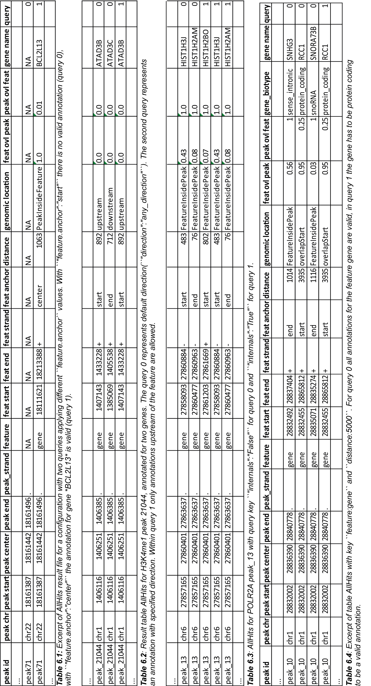
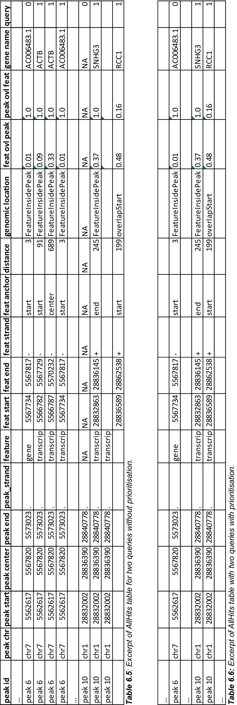

Application examples
====================
In this section several typical use cases for UROPA are presented. 
A detailed introduction of all available keys can be found in the section :doc:`/config`.
A detailed information about the output formats can be found in the section :doc:`/output`.

In :ref:`Figure 1 <genomic-location>` a general overview about the genomic location of peaks and their direction is displayed. 
It illustrates the definition of a set of config keys such as ``direction`` or ``internals``.
Direction is illustrated in the entities upstream and downstream of a feature, taking the strand into account.
The genomic location of a peak is illustrated with its entities (given in the :doc:`/output`).

.. _genomic-location:

.. figure:: img/peak_Upstream_Downstream_of_gene.png
   :alt: peak\_upstream

   Locations and directions of peaks (green) and features(blue).

   There are five peaks in close proximity to gene A: The first peak (from left) is located upstream of Gene A and would
   be annotated, if ``direction:upstream`` is configured. The second peak would also be annotated within a
   ``direction:upstream`` configuration, because the peak center is upstream of the feature start position(genomic location for this peak is 
   overlapStart). The third peak would not be annotated with ``direction:upstream`` configuration. However, in case of annotation (due to other configuration), 
   the genomic location of this peak is PeakInsideFeature. 
   
   The next two peaks (third and fourth from left), are annotated in a ``direction:downstream`` configuration. As described for
   upstream, both peaks are located downstream of gene A, but report different genomic locations: overlapEnd and downstream. 
   
   The next peak from left could be annotated for gene B which is located inside the peak, representing the genomic location FeatureInsidePeak. 
   The last two peaks close to gene C have the genomic locations overlapStart and overlapEnd. Only the last peak has a peak center located upstream of the peak and is found in a ``direction:upstream`` configuration. 

The following examples are based on either H3K4me1 (ENCFF001SUE) or POLR2A (ENCFF001VFA) peaks, and on either Ensembl (Homo_sapiens.GRCh37.75) or Gencode v19 (gencode.v19.annotation) GTF files. 
Detailed references see :ref:`used-files`.

.. _example-1:

Example 1: ``feature.anchor``
-----------------------------
UROPA maximise flexibility in terms of annotation. With the key ``feature.anchor`` it is possible to decide from which anchor point of the feature the distance to the peak (center) should be calculated. 
Typically for other tools, the distance is calculated from the TSS of a gene, correspond to ``start`` in UROPA. Besides start, UROPA supports the ``center`` and ``end`` of the feature. 
This could be useful for the annotation of histone marks and can be applied in the query definition by setting the ``feature.anchor`` to the suitable position. 

By default, the distances from all three positions to the peak center are calculated and the closest distance is chosen. 
Only if the chosen distance is smaller or equal to the maximum distance defined in the ``distance`` key, the peak will be annotated for that feature. 

The Allhits Table 1 represents the annotation for a peak located inside a feature(third peak from right in :ref:`Figure 1 <genomic-location>`). 
Assuming *gene A* is very large, the peak center is far away from the start of the gene. If using the center as ``feature.anchor`` it is found as a valid annotation. 

That is what happens for peak 71 with the configuration as followed: 

.. code:: json
	
	{
	"queries": [
		{"feature":"gene", "distance":5000, "feature.anchor": "start", "show.attributes":"gene_name"},
		{"feature": "gene","distance":5000, "feature.anchor":"center"}],
	"priority" : "False",
	"gtf": "gencode.v19.annotation.gtf",
	"bed": "ENCFF001SUE.bed"
	}

.. hint:: 
	If the size of the chosen feature is highly variable, the key ``internals`` could be used (see :ref:`Example 3 <example-3>`).

Example 2: ``direction``
------------------------

In the following example the utility of the key ``direction`` is illustrated. It can be a very important player for a specialized annotation. 
Compare the peaks with upstream direction in :ref:`Figure 1 <genomic-location>`.

If  ``direction:upstream`` is used, peaks will be annotated to a feature if the peak centre is upstream of the feature start and the distance from the ``feature.anchor`` is smaller than the chosen ``distance`` value. 
Same takes effect for ``direction:downstream`` where the location of the peak is expected to be downstream of the gene end.

Thus, the location of the peak is relative to the feature's direction. 
An overlap of the feature to the start or end of the peak is partially possible, but the overlap of the peak needs to be < 50%.

This example is illustrated on the peak displayed in Figure 2. It is located between two genes. Because both distances are very small, it can be tricky to decide which annotation is the best.
With respect to gene *ATAD3C* it is located downstream, with respect to *ATAD3B* is is located upstream. 
Depending on the nature of the peaks, the more suitable configuration can be used for the direction key.   

.. figure:: img/chr1-1,403,500-1,408,500-01_h3k4me1_peaks.png

   H3K4me1 peak_21044 (chr1:1,403,500-1,408,500) annotated with the Gencode GTF. By eye, there are two valid annotation, the genes *ATAD3B* and *ATAD3C*. 
   Depending on the biological background of the peak, one allocation is more suitable than the other.
   Due to the knowledge that the peaks represent H3K4me1 marks, a location upstream of a gene is more likely than downstream. 

In the following excerpt of a result file, the UROPA annotation was performed with two queries:

.. code:: json

  {
  "queries": [
  	{"feature": "gene", "distance":1000, "show.attributes":"gene_name"},
  	{"feature": "gene", "distance":1000, "direction":"upstream"}],
  "gtf": "gencode.v19.annotation.gtf",
  "bed": "ENCFF001SUE.bed"
  }

The peak 21044 displayed in Figure 2 would be annotated for both genes as displayed in Table 2. For query 0 the final hit for this peak is gene *ATAD3C* due to the smaller distance. However, the annotation for gene *ATAD3B* might be more suitable, because H3K4me1 is known to flank enhancers which are located upstream of genes. This annotation behaviour is reached with query 1. In this case the annotation for the downstream located feature is no longer valid. 

.. _example-3:

Example 3: ``internals``
------------------------

In some cases the relation of feature and peak size differs a lot. In these cases  peak annotations might get lost even if the peak is located within a feature and vise versa because the limiting distance value is reached.                                           
To avoid this, the ``internals`` key can be used. With this key, peaks are allowed to be annotated for features even if the distance is larger than specified.
By default the parameter is set to False.       

.. note::
	Compare to :ref:`Example 1 <example-1>`: With ``"internals":"True"`` it would not be necessary to identify the most appropriate ``feature.anchor`` 
	because the peak is located inside the feature and it would not be rejected by exceeding the given distance value.

This example is based on the peak displayed in Figure 3. The peak is very large and the region includes three different genes. 
	
.. figure:: img/chr6-27,857,165-27,863,637_internal_feature-01.png
   :alt: internal.feature
   
   POLR2A  peak 13 (chr6:27,858,000-27,863,000) annotated with Ensembl. The peak is very large: without using ``internals``, 
   some features get lost because of large distances.
   Setting this key ensures to keep features that are located within peaks and vice versa.

The first query (query 0) of the following configuration displays the default behaviour of the ``internals`` key. In the second query (query 1) the key is set to ``TRUE``:

.. code:: json

	{
	"queries":[
		{"feature":"gene", "distance":500, "show.attributes":"gene_name"},
		{"feature":"gene", "distance":500, "internals":"True"}],
	"gtf":"Homo_sapiens.GRCh37.75.gtf",
	"bed":"ENCFF001VFA.bed"
	}

As displayed in Table 3, there are two valid annotation for the given configuration for query 0. But the third gene in this genomic regions is missed due to the large distance to any ``feature.anchor``. 
This is different for query 1. Even with the exceeded distance limit, the third gene is annotated for this peak. The annotation for this peak is also a good example for the usage of the different output tables. 
The annotation for gene *HIST1H2AM* would be represented in the FinalHits for both queries.

Example 4: ``filter.attribute`` + ``attribute.value`` 
-----------------------------------------------------

If the annotation should be more specific, the linked keys ``filter.attribute`` and ``attribute.value`` can be used. With those it is possible to further restrict the annotation. 
For example, the peaks should not just genes but only protein coding genes.

The most general key aims for a specific feature, e.g. genes (with the key ``feature``). Further characteristics that should be fulfilled are added with the linked keys. 
The first query of the following config has no further filters than ``"feature":"gene"``. The second query aims for genes that are "protein_coding". The corresponding attribute is "gene_biotype" (See GTF file). 
That attribute name has to be termed in the ``filter.attribute`` key. The corresponding value which should be accepted has to be named in the ``attribute.value`` key.

.. code:: json
	
	{
	"queries":[
		{"feature":"gene", "distance":5000, "show.attributes":["gene_name","gene_biotype"]},
		{"feature":"gene", "distance":5000, "filter.attribute": "gene_biotype", 
			"attribute.value": "protein_coding"}],
	"gtf":"Homo_sapiens.GRCh37.75.gtf",
	"bed":"ENCFF001VFA.bed"
	}

As shown in the AllHits Table 4, there are three valid annotations for peak 10 for query 0 but only one valid annotation for query 1. The final hit for query 0 would be the annotation for *SNHG3* with a distance of 1014 bp. But this might not what one is expecting from an annotation run, as the gene biotype is intronic. 

.. tip:: It is just possible to filter for values given in the attribute column. GTF source files can contain different attribute keys and values, so make sure the chosen values are present.

Example 5: ``priority`` 
-----------------------

More than one query can be defined.    
If there are more queries, it is important to decide if they should be prioritized. In the preceded examples no priority was used, means all queries were evaluated.
The following examples illustrates the beneficial effect of ``priority``.

Configuration with two queries and without prioritisation:

.. code:: json

	{
	"queries":[
		{"feature":"gene", "distance":1000, "show.attributes":"gene_name"},
		{"feature":"transcript", "distance":1000}], 
	"priority" : "False",
	"gtf":"Homo_sapiens.GRCh37.75.gtf",
	"bed":"ENCFF001VFA.bed"
	}

The above set of queries will allow UROPA to annotate peaks for genes and transcripts. As priority is False (default), there is no query
prioritized. As presented in the AllHits Table 5, there are valid annotations for peak 6 with both queries. The annotation for the feature
gene would be presented in the FinalHits. For peak 10, there are only valid annotations for the second query, the annotation for the gene *RCC1* correspond to
the best annotation and would be represented in the FinalHits.

Next, after changing the ``priority`` flag in the configuration above to ``"priority":"TRUE"``, the result looks like:

If priority is TRUE, UROPA will annotate peaks with the **first feature** found, taking the order of queries into account. 
Once an annotation is assigned, the following queries are not evaluated at all for the current peak.
The example is based on the same cases as above.
As peak 6 was annotated by query 0, query 1 is not evaluated. 
For peak 10, there was no valid annotation for query 0, thus query 1 was evaluated and a valid annotation was identified. 

.. hint::
  - For priority true there will not be an NA row for queries without valid annotations. 
  - If there is no valid annotation for a peak across all queries, there is a combined NA row for all queries (NA NA ... NA 0,1)
  - There will be no BestperQuery_Hits if priority is TRUE, as there is only one final annotation per peak
   

   

   
   
.. _used-files:

Used example peak and annotation files 
------------------------------ 

Annotation:  

- Ensembl database of the human genome, version hg19 (GRCh37): `Ensembl genome`_ 
- Human Gencode genome, version hg19: `Gencode genome`_        

Peak and signal files based on ChIP-seq of GM12878 immortalized cell line:
                       
- `H3K4me1`_ (accession ENCFF001SUE for bed file)                       
- `POLR2A`_  (accession ENCFF001VFA for bed file)

.. note:: Peak ids are manually added to make it easier to describe different peaks. 

.. _H3K4me1: https://www.encodeproject.org/experiments/ENCSR000AKF/
.. _POLR2A: https://www.encodeproject.org/experiments/ENCSR000EAD/
.. _Gencode genome: ftp://ftp.sanger.ac.uk/pub/gencode/Gencode_human/release_19/ 
.. _Ensembl genome: ftp://ftp.ensembl.org/pub/release-75/gtf/homo_sapiens/ 