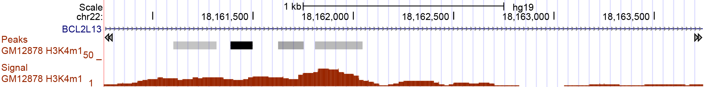
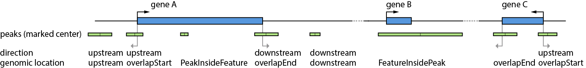
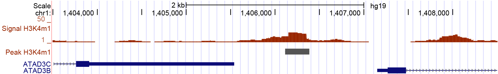
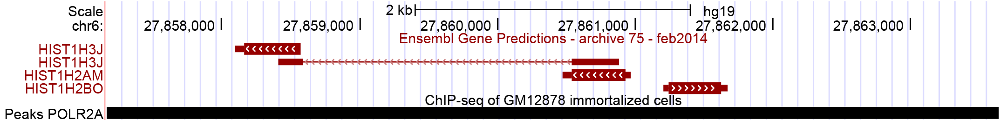

Application examples
====================
In this section several examples for the usage of the config file are presented. 
A detailed introduction of how to use the config file can be found in the section :doc:`/config`.
There is also a detailed information about the different output formats in the section :doc:`/output`.

The following examples are based on either H3K4me1 peaks (ENCFF001SUE) or POLR2A peaks (ENCFF001VFA), and on either Ensembl GTF file (Homo_sapiens.GRCh37.75) or Gencode v19 GTF file (gencode.v19.annotation).

Example 1: 'feature.anchor' key
-------------------------------
UROPA allows a flexibility of annotation for features. With the key **feature.anchor** it is possible to decide from where the distance to the peak should be calculated. 
Typically, the distance is calculated from the TSS, correspond to 'start' in UROPA. Furthermore, it is possible to use the 'center' and 'end' of the feature for the distance calculation. 
This might be useful for the annotation of histone marks. Different marks are known to be located in the promoter region of genes, in gene bodies, or in the end of genes. 
This knowledge can be applied in the query definition by setting the feature.anchor to the suitable position within the feature. 

If no value is given, the distances from all three positions to the peak center are calculated and the closest is choosen. 
Only if the choosen distance is smaller or equal to the distance defined in the 'distance' key, the peak will be annotated for that feature. 
The position closer to the peak.center will be indicated in the output file in the column **'feat_anchor'**.

For example in Figure 1, assumed the black marked peak is a representative of a histone mark that is known to be located within the gene body. 
Dependent of how the query is specified, there can be a valid annotation or not. This is shown in the example below.

   *Figure 1:* H3K4me1 peak_71 (chr22:18161387-18161496) annotated with Gencode v19 GTF file. 
   A valid annotation with specified feature.anchor:center in the config file is gene *BCL2L13*  with a distance of 1063 bp (feature_center to peak_center).

**Config**

.. code:: json
  {
	"queries": [
		{"feature":"gene", "distance":5000, "feature.anchor": "start", 
      "show.attributes":"gene_name"},
		{"feature": "gene","distance":5000, "feature.anchor": "center"}],
    "priority" : "False",
    "gtf": "gencode.v19.annotation.gtf",
    "bed": "ENCFF001SUE.bed"
	}

+---------+----------+------------+-------------+------------+-------------+---------+------------+-------------+-------------+-------------+----------+-------------------+---------------+---------------+-----------+-------+
| peak_id | peak_chr | peak_start | peak_center | peak_end   | peak_strand | feature | feat_start | feature_end | feat_strand | feat_anchor | distance | genomic_location  | feat_ovl_peak | peak_ovl_feat | gene_name | query |
+=========+==========+============+=============+============+=============+=========+============+=============+=============+=============+==========+===================+===============+===============+===========+=======+
| …       |          |            |             |            |             |         |            |             |             |             |          |                   |               |               |           |       |
+---------+----------+------------+-------------+------------+-------------+---------+------------+-------------+-------------+-------------+----------+-------------------+---------------+---------------+-----------+-------+
| peak_71 | chr22    | 18161387   | 18161441.5  | 18161496   | .           | NA      | NA         | NA          | NA          | NA          | NA       | NA                | NA            | NA            | NA        | 0     |
+---------+----------+------------+-------------+------------+-------------+---------+------------+-------------+-------------+-------------+----------+-------------------+---------------+---------------+-----------+-------+
| peak_71 | chr22    | 18161387   | 18161441.5  | 18161496   | .           | gene    | 18111621   | 18213388    | \+          | center      | 1063     | PeakInsideFeature | 1.0           | 0.01          | BCL2L13   | 1     |
+---------+----------+------------+-------------+------------+-------------+---------+------------+-------------+-------------+-------------+----------+-------------------+---------------+---------------+-----------+-------+
| …       |          |            |             |            |             |         |            |             |             |             |          |                   |               |               |           |       |
+---------+----------+------------+-------------+------------+-------------+---------+------------+-------------+-------------+-------------+----------+-------------------+---------------+---------------+-----------+-------+

**Table 1:** AllHits with annotation with two queries containing different feature.anchor and default priority.

Concerning the other output tables:

-  FinalHits will only contain the second column with a valid annotation

-  BestperQuery\_Hits will be the same as the AllHits in this case,
   because there are no multiple valid annotations for the queries.
   
.. hint:: 
	Similar cases of peaks being internally to the genomic region of a feature (and also features inside peaks) can be well-annotated using the key 'internals'. 
	This is further eyplained in Example 3.

Example 2: 'direction' key
--------------------------

In the following example the utility of the key **direction** will be illustrated. It is optional but can be a very important player for a specialized annotation, see Figure 2.

When the direction key is set to *upstream*, peaks will be annotated to a feature if the peak center is upstream of the feature and the distance from the feature.anchor is smaller than the limit distance. 
Same for *downstream*  where the location of the peak should be downstream of the gene.

Thus,the location of the peak is relative to the feature's direction. 
An overlap of the feature to the start or end of the peak is partially allowed, but the overlap should allow a clear evidence of the upstream or downstream location of the peak.

   Figure2: Possible locations of a peak. There are five peaks close to gene A: The first peak (from left) is located upstream of it, it would
   be annotated within a direction:upstream annotation an has the genomic location upstream. The second peak would also be annotated within a
   direction:upstream process because the peak center is upstream of the feature start position, but the genomic location for this peak would be 
   overlapStart instead of upstream. The third peak would not be annotated with direction:upstream, but if the configuration allows an annotation,
   the genomic location would be PeakInsideFeature. Among other configurations, the next two peaks (third and fourth), would be annotated in a direction:downstream configuration. Like described for
   upstream, both peaks are located downstram of gene A, but with different genomic locations: overlapEnd and downstream. The sixed peak from left
   could be annotated for gene B which is located inside it, representing the genomic location FeatureInsidePeak. The last two peaks close to gene C have the genomic locations overlapStart and overlapEnd, but due to
   that the center is not upstream or rather downstream, they would not be annotated for direction:upstream or direction:downstream annotation keys.

The following Example is based on the peak displayed in Figure 3. This peak is located between two genes. With respect to gene *ATAD3C* it is located downstream, but with respect to *ATAD3B* is is located upstream. 
Depending on the nature of the peaks, a more suitable configuration can be adjusted using the direction key.   

   Figure 3: H3K4me1 peak_21044 (chr1:1,403,500-1,408,500) annotated with the Gencode GTF. By eye one would guess that there are two valid annotation, the genes ATAD3B and ATAD3C. Depending on the peak nature, it could be that one allocation is wiser than the other.
   Due to the knowledge that the peaks represent H3K4me1 marks, a location upstream of a gene might be more likely than downstream, even if that location has a smaller distance. Specifications like this can be adjusted with the query key 'direction'. 

No specified direction
~~~~~~~~~~~~~~~~~~~~~~
Without adjustment of the direction the peak would be annotated as described below. 

**Config**

.. code:: json

  {
	"queries": [{"feature": "gene", "attribute":"gene_name", "distance":1000,
    "direction":"any_direction"}],
  "gtf": "gencode.v19.annotation.gtf",
  "bed": "ENCFF001SUE.bed"
  }

+------------+----------+------------+-------------+------------+-------------+---------+------------+-------------+-------------+-------------+----------+------------------+---------------+---------------+-----------+-------+
| peak_id    | peak_chr | peak_start | peak_center | peak_end   | peak_strand | feature | feat_start | feature_end | feat_strand | feat_anchor | distance | genomic_location | feat_ovl_peak | peak_ovl_feat | gene_name | query |
+============+==========+============+=============+============+=============+=========+============+=============+=============+=============+==========+==================+===============+===============+===========+=======+
| …          |          |            |             |            |             |         |            |             |             |             |          |                  |               |               |           |       |
+------------+----------+------------+-------------+------------+-------------+---------+------------+-------------+-------------+-------------+----------+------------------+---------------+---------------+-----------+-------+
| peak_21044 | chr1     | 1406116    | 1406250.5   | 1406385    | .           | gene    | 1407143    | 1433228     | \+          | start       | 892      | upstream         | 0.0           | 0.0           | ATAD3B    | 0     |
+------------+----------+------------+-------------+------------+-------------+---------+------------+-------------+-------------+-------------+----------+------------------+---------------+---------------+-----------+-------+
| peak_21044 | chr1     | 1406116    | 1406250.5   | 1406385    | .           | gene    | 1385069    | 1405538     | \+          | end         | 712      | downstream       | 0.0           | 0.0           | ATAD3C    | 1     |
+------------+----------+------------+-------------+------------+-------------+---------+------------+-------------+-------------+-------------+----------+------------------+---------------+---------------+-----------+-------+
| …          |          |            |             |            |             |         |            |             |             |             |          |                  |               |               |           |       |
+------------+----------+------------+-------------+------------+-------------+---------+------------+-------------+-------------+-------------+----------+------------------+---------------+---------------+-----------+-------+

**Table 2:** AllHits for H3K4me1 peak 21044 annotated for two genes with different directions of the peak.

The peak 21044 displayed in Figure 3 would be annotated for both genes, displayed in Table 2.
Due to the fact that no feature.anchor was defined, the distance shown in Table 2 is calculated to the closed feature.anchor: *start* for *ATAD3B* and *end* for *ATAD3C*.             
The annotation for gene *ATAD3C* with the minimal distance of 712 bp would be represented in the FinalHits. 
Biologically it might be more probable to annotate this peak for *ATAD3B*, because H3K4me1 markes are known to flank enhancers which are located upstream of genes. 

Specified direction
~~~~~~~~~~~~~~~~~~~
It is possible to include the knowledge of probable genomic location of peaks with respect to the features in the configuration, using the direction key. 

**Config**

.. code:: json

  {
  "queries": [{"feature": "gene", "attribute":"gene_name", "distance":1000, 
    "direction":"upstream" }],
  "gtf": "gencode.v19.annotation.gtf",
  "bed": "ENCFF001SUE.bed"
	}

In this case the peak will only be annotated for *ATAD3B*, because it is located 'upstream' to it. The annotation for *ATAD3C* is no longer valid.

So globally this example shows that more specific configuration can be useful for peaks like this one, in order to obtain a unique feature matching more specific requirements. 

Example 3: 'internals' key
--------------------------

Sometime the relation of feature size and peak size differs a lot. In this cases it can happen that peak annotations get lost even if the peak is located within a feature and vise versa because the limit distance is reached. 
If those hits should not get lost, the **internals** key can be used. With this adjustment peaks are allowed to be annotated for peaks even if the distance is larger than specified, 
but only if the feature is inside the peak or inversely.
By default the parameter is set to 'False'. With this setting, peaks are only annotated with features whose distance is smaller than the defined one.          

This example is based on the peak displayed in Figure 4. The peak is very large and the region includes three different genes. 

Also the peak analyzed in Example 1 is a good example for the usage of the internals key. 
With the internals key set to True it would not be necessay to identify the best feature.anchor because due to that the peak is located inside the feature, it would not be rejected by reached distance.
	

   
   Figure 4: POLR2A  peak 13 (chr6:27,858,000-27,863,000) annotated with Ensembl. The peak is very large: without using the internals key, 
   lots of features might get lost because of a to large distance.
   Including this key ensures to keep features that are located within peaks and vice versa, even if the distance exceeds the limit.

Default internals key
~~~~~~~~~~~~~~~~~~~~~
With default internals adjustment, the distance limit is fixed for any peak location. 

**Config**

.. code:: json

  {
  "queries":[
    {"feature":"gene", "distance":500, "show.attributes":"gene_name", "internals" : "False"}],
  "gtf":"Homo_sapiens.GRCh37.75.gtf",
  "bed":"ENCFF001VFA.bed"
	} 

+---------+----------+------------+-------------+------------+-------------+---------+------------+-------------+-------------+-------------+----------+-------------------+---------------+---------------+-----------+-------+
| peak_id | peak_chr | peak_start | peak_center | peak_end   | peak_strand | feature | feat_start | feature_end | feat_strand | feat_anchor | distance | genomic_location  | feat_ovl_peak | peak_ovl_feat | gene_name | query |
+=========+==========+============+=============+============+=============+=========+============+=============+=============+=============+==========+===================+===============+===============+===========+=======+
| …       |          |            |             |            |             |         |            |             |             |             |          |                   |               |               |           |       |
+---------+----------+------------+-------------+------------+-------------+---------+------------+-------------+-------------+-------------+----------+-------------------+---------------+---------------+-----------+-------+
| peak_13 | chr6     | 27857165   | 27860401    | 27863637   | .           | gene    | 27858093   | 27860884    | \-          | start       | 483      | FeatureInsidePeak | 0.43          | 1.0           | HIST1H3J  | 0     |
+---------+----------+------------+-------------+------------+-------------+---------+------------+-------------+-------------+-------------+----------+-------------------+---------------+---------------+-----------+-------+
| peak_13 | chr6     | 27857165   | 27860401    | 27863637   | .           | gene    | 27860477   | 27860963    | \-          | end         | 76       | FeatureInsidePeak | 0.08          | 1.0           | HIST1H2AM | 1     |
+---------+----------+------------+-------------+------------+-------------+---------+------------+-------------+-------------+-------------+----------+-------------------+---------------+---------------+-----------+-------+
| …       |          |            |             |            |             |         |            |             |             |             |          |                   |               |               |           |       |
+---------+----------+------------+-------------+------------+-------------+---------+------------+-------------+-------------+-------------+----------+-------------------+---------------+---------------+-----------+-------+

**Table 3:** AllHits for POLR2A peak_13 with query key internals:False.

As displayed in Table 3, there are two valid annotation for the given
configuration. But the third gene in this genomic regions is missed due to a to large distance to any feature.anchor.

Specified internals key
~~~~~~~~~~~~~~~~~~~~~~~
With internals key set to True, the distance limit is skiped for peaks inside features and inversely.

**Config**

.. code:: json

  {
	"queries":[
  {"feature":"gene", "distance":500, "show.attributes":"gene_name", "internals" : "True"}],
  "gtf":"Homo_sapiens.GRCh37.75.gtf",
  "bed":"ENCFF001VFA.bed"
	}

+---------+----------+------------+-------------+------------+-------------+---------+------------+-------------+-------------+-------------+----------+-------------------+---------------+---------------+-----------+-------+
| peak_id | peak_chr | peak_start | peak_center | peak_end   | peak_strand | feature | feat_start | feature_end | feat_strand | feat_anchor | distance | genomic_location  | feat_ovl_peak | peak_ovl_feat | gene_name | query |
+=========+==========+============+=============+============+=============+=========+============+=============+=============+=============+==========+===================+===============+===============+===========+=======+
| …       |          |            |             |            |             |         |            |             |             |             |          |                   |               |               |           |       |
+---------+----------+------------+-------------+------------+-------------+---------+------------+-------------+-------------+-------------+----------+-------------------+---------------+---------------+-----------+-------+
| peak_13 | chr6     | 27857165   | 27860401    | 27863637   | .           | gene    | 27861203   | 27861669    | \+          | start       | 802      | FeatureInsidePeak | 0.07          | 1.0           | HIST1H2BO | 0     |
+---------+----------+------------+-------------+------------+-------------+---------+------------+-------------+-------------+-------------+----------+-------------------+---------------+---------------+-----------+-------+
| peak_13 | chr6     | 27857165   | 27860401    | 27863637   | .           | gene    | 27858093   | 27860884    | \-          | start       | 483      | FeatureInsidePeak | 0.43          | 1.0           | HIST1H3J  | 0     |
+---------+----------+------------+-------------+------------+-------------+---------+------------+-------------+-------------+-------------+----------+-------------------+---------------+---------------+-----------+-------+
| peak_13 | chr6     | 27857165   | 27860401    | 27863637   | .           | gene    | 27860477   | 27860963    | \-          | end         | 76       | FeatureInsidePeak | 0.08          | 1.0           | HIST1H2AM | 1     |
+---------+----------+------------+-------------+------------+-------------+---------+------------+-------------+-------------+-------------+----------+-------------------+---------------+---------------+-----------+-------+
| …       |          |            |             |            |             |         |            |             |             |             |          |                   |               |               |           |       |
+---------+----------+------------+-------------+------------+-------------+---------+------------+-------------+-------------+-------------+----------+-------------------+---------------+---------------+-----------+-------+

**Table 4:** AllHits for POLR2A  peak_13 with query key internals:True.

As displayed in Table 4 now there are three genes annotated for this peak. One more valid annotation as without the internals key set to True. All of them are located inside of the peak as shown in Figure 3.    
Whether the peak is inside the feature or the feature in the peak is displayed in the genomic_location column of the output files. 

These examples make overally evident, that depending on the biological relevance, it can be very useful to utilize more flexible keys and allow better control of results. 

Example 4: 'filter.attribute' + 'attribute.value' keys
---------------------------------------------------------

If the annotation should be more particularized, the linked keys filter.attribute + attribute.value can be used. With those it is possible to further restrict the annotation. 
For example, the peaks should not just be annotated genes but protein coding genes. Things like this can be done with the linked keys.

No linked keys specified
~~~~~~~~~~~~~~~~~~~~~~~~
The main annotation is for a specific feature, for example genes. This is specified with the key feature. 

**Config**

.. code:: json
  
  {
  "queries":[
		{"feature":"gene", "distance":5000, "show.attributes":["gene_name","gene_biotype"]}],
  "gtf":"Homo_sapiens.GRCh37.75.gtf",
  "bed":"ENCFF001VFA.bed"
  }

+---------+----------+------------+-------------+------------+-------------+---------+------------+-------------+-------------+-------------+----------+-------------------+---------------+---------------+-----------+----------------+-------+
| peak_id | peak_chr | peak_start | peak_center | peak_end   | peak_strand | feature | feat_start | feature_end | feat_strand | feat_anchor | distance | genomic_location  | feat_ovl_peak | peak_ovl_feat | gene_name | gene_biotype   | query |
+=========+==========+============+=============+============+=============+=========+============+=============+=============+=============+==========+===================+===============+===============+===========+================+=======+
| …       |          |            |             |            |             |         |            |             |             |             |          |                   |               |               |           |                |       |
+---------+----------+------------+-------------+------------+-------------+---------+------------+-------------+-------------+-------------+----------+-------------------+---------------+---------------+-----------+----------------+-------+
| peak_10 | chr1     | 28832002   | 28836390    | 28840778   | .           | gene    | 28832492   | 28837404    | \+          | end         | 1014     | FeatureInsidePeak | 0.56          | 1.0           | SNHG3     | sense_intronic | 0     |
+---------+----------+------------+-------------+------------+-------------+---------+------------+-------------+-------------+-------------+----------+-------------------+---------------+---------------+-----------+----------------+-------+
| peak_10 | chr1     | 28832002   | 28836390    | 28840778   | .           | gene    | 28832455   | 28865812    | \+          | start       | 3935     | overlapStart      | 0.95          | 0.25          | RCC1      | protein_coding | 0     |
+---------+----------+------------+-------------+------------+-------------+---------+------------+-------------+-------------+-------------+----------+-------------------+---------------+---------------+-----------+----------------+-------+
| peak_10 | chr1     | 28832002   | 28836390    | 28840778   | .           | gene    | 28835071   | 28835274    | \+          | end         | 1116     | FeatureInsidePeak | 0.03          | 1.0           | SNORA73B  | snoRNA         | 0     |
+---------+----------+------------+-------------+------------+-------------+---------+------------+-------------+-------------+-------------+----------+-------------------+---------------+---------------+-----------+----------------+-------+
| …       |          |            |             |            |             |         |            |             |             |             |          |                   |               |               |           |                |       |
+---------+----------+------------+-------------+------------+-------------+---------+------------+-------------+-------------+-------------+----------+-------------------+---------------+---------------+-----------+----------------+-------+

**Table 5:** AllHits for annotation with feature gene and distance 5000, the linked keys filter.attribute and attribute.value are not specified.

As shown in the AllHits Table 5 there are three valid annotations for peak 10. The final hit would be the annotation for *SNHG3* with a distance of 1014 bp. But maybe this is not what one is interested in because the gene biotype is sense intronic.
Analyzing enhancers, it would be biologically more interesting to just look for protein coding genes. This can be reached using the linked keys as shown below.

Specified linked keys
~~~~~~~~~~~~~~~~~~~~~
**Config**

.. code:: json
  
  {
  "queries":[{"feature":"gene", "distance":5000, "show.attributes":["gene_name","gene_biotype"], 
    "filter.attribute": "gene_biotype", "attribute.value": "protein_coding"}],
  "gtf":"Homo_sapiens.GRCh37.75.gtf",
  "bed":"ENCFF001VFA.bed"
  }
	
+---------+----------+------------+-------------+------------+-------------+---------+------------+-------------+-------------+-------------+----------+-------------------+---------------+---------------+-----------+----------------+-------+
| peak_id | peak_chr | peak_start | peak_center | peak_end   | peak_strand | feature | feat_start | feature_end | feat_strand | feat_anchor | distance | genomic_location  | feat_ovl_peak | peak_ovl_feat | gene_name | gene_biotype   | query |
+=========+==========+============+=============+============+=============+=========+============+=============+=============+=============+==========+===================+===============+===============+===========+================+=======+
| …       |          |            |             |            |             |         |            |             |             |             |          |                   |               |               |           |                |       |
+---------+----------+------------+-------------+------------+-------------+---------+------------+-------------+-------------+-------------+----------+-------------------+---------------+---------------+-----------+----------------+-------+
| peak_10 | chr1     | 28832002   | 28836390    | 28840778   | .           | gene    | 28832455   | 28865812    | \+          | start       | 3935     | overlapStart      | 0.95          | 0.25          | RCC1      | protein_coding | 0     |
+---------+----------+------------+-------------+------------+-------------+---------+------------+-------------+-------------+-------------+----------+-------------------+---------------+---------------+-----------+----------------+-------+
| …       |          |            |             |            |             |         |            |             |             |             |          |                   |               |               |           |                |       |
+---------+----------+------------+-------------+------------+-------------+---------+------------+-------------+-------------+-------------+----------+-------------------+---------------+---------------+-----------+----------------+-------+

**Table 6:** AllHits for annotation with feature gene and distance 5000, the linked keys filter.attribute and attribute.value are specified.
	

By adding the linked keys filter.attribute and attribute.value to the config file, the annotation is further specified. As displayed in Table 6 there is only one valid annotation for gene biotype protein_coding. 
This is for gene *RCC1* with a distance of 3935 bp. Of course this distance is larger than this to the final hit of configuration without the linked keys, but depending on what is wanted, this might be the better annotation. 

.. tip:: The two keys "filter.attribute" and "attribute.value" are dependent, both have to be given for a proper use of filtering. Additionally, it is just possible to filter for values given in the attribute column. 
GTF source files can contain different attribute keys and values, so make sure the chosen values are present.

Example 5: 'priority' flag
-----------------------------

More than one query can be given, keeping the same gtf and bed files, allowing for a combination of annotation in one run.    
If there are more queries, it is important to decide if they should be priorized. This can be done with the priority key in the config file.   
The following examples illustrate how this can be beneficial for the annotation.

No priorization
~~~~~~~~~~~~~~~

**Config** 

.. code:: json

  {
  "queries": [
    {"feature":"gene", "distance":1000, "show.attributes":"gene_name"},
		{"feature":"transcript", "distance":1000}], 
  "gtf":"Homo_sapiens.GRCh37.75.gtf",
  "bed":"ENCFF001VFA.bed"
  }

+---------+----------+------------+-------------+------------+-------------+------------+------------+-------------+-------------+-------------+----------+-------------------+---------------+---------------+------------+-------+
| peak_id | peak_chr | peak_start | peak_center | peak_end   | peak_strand | feature    | feat_start | feature_end | feat_strand | feat_anchor | distance | genomic_location  | feat_ovl_peak | peak_ovl_feat | gene_name  | query |
+=========+==========+============+=============+============+=============+============+============+=============+=============+=============+==========+===================+===============+===============+============+=======+
| …       |          |            |             |            |             |            |            |             |             |             |          |                   |               |               |            |       |
+---------+----------+------------+-------------+------------+-------------+------------+------------+-------------+-------------+-------------+----------+-------------------+---------------+---------------+------------+-------+
| peak_6  | chr7     | 5562617    | 5567820     | 5573023    | .           | gene       | 5567734    | 5567817     | \-          | start       | 3        | FeatureInsidePeak | 0.01          | 1.0           | AC006483.1 | 0     |
+---------+----------+------------+-------------+------------+-------------+------------+------------+-------------+-------------+-------------+----------+-------------------+---------------+---------------+------------+-------+
| peak_6  | chr7     | 5562617    | 5567820     | 5573023    | .           | transcript | 5566782    | 5567729     | \-          | start       | 91       | FeatureInsidePeak | 0.09          | 1.0           | ACTB       | 1     |
+---------+----------+------------+-------------+------------+-------------+------------+------------+-------------+-------------+-------------+----------+-------------------+---------------+---------------+------------+-------+
| peak_6  | chr7     | 5562617    | 5567820     | 5573023    | .           | transcript | 5566787    | 5570232     | \-          | center      | 689      | FeatureInsidePeak | 0.33          | 1.0           | ACTB       | 1     |
+---------+----------+------------+-------------+------------+-------------+------------+------------+-------------+-------------+-------------+----------+-------------------+---------------+---------------+------------+-------+
| peak_6  | chr7     | 5562617    | 5567820     | 5573023    | .           | transcript | 5567734    | 5567817     | \-          | start       | 3        | FeatureInsidePeak | 0.01          | 1.0           | AC006483.1 | 1     |
+---------+----------+------------+-------------+------------+-------------+------------+------------+-------------+-------------+-------------+----------+-------------------+---------------+---------------+------------+-------+
| …       |          |            |             |            |             |            |            |             |             |             |          |                   |               |               |            |       |
+---------+----------+------------+-------------+------------+-------------+------------+------------+-------------+-------------+-------------+----------+-------------------+---------------+---------------+------------+-------+
| peak_10 | chr1     | 28832002   | 28836390    | 28840778   | .           | NA         | NA         | NA          | NA          | NA          | NA       | NA                | NA            | NA            | NA         | 0     |
+---------+----------+------------+-------------+------------+-------------+------------+------------+-------------+-------------+-------------+----------+-------------------+---------------+---------------+------------+-------+
| peak_10 | chr1     | 28832002   | 28836390    | 28840778   | .           | transcript | 28832863   | 28836145    | \+          | end         | 245      | FeatureInsidePeak | 0.37          | 1.0           | SNHG3      | 1     |
+---------+----------+------------+-------------+------------+-------------+------------+------------+-------------+-------------+-------------+----------+-------------------+---------------+---------------+------------+-------+
| peak_10 | chr1     | 28832002   | 28836390    | 28840778   | .           | transcript | 28836589   | 28862538    | \+          | start       | 199      | overlapStart      | 0.48          | 0.16          | RCC1       | 1     |
+---------+----------+------------+-------------+------------+-------------+------------+------------+-------------+-------------+-------------+----------+-------------------+---------------+---------------+------------+-------+

**Table 7:** AllHits for two queries without priorization.

The above set of queries will allow UROPA to annotate peaks for genes and transcripts. As priority is False (default), there is no query
priorized. As presented in the AllHits Table 7, there are valid annotations for peak 6 with both queries. The annotation for the feature
gene would be presented in the FinalHits. For peak 10, there are only valid annotations for the second query, the annotation for the gene *RCC1* correspond to
the best annotation and would be resprented in the FinalHits.
Configuration for the second annotation with priority true:

With  priorization
~~~~~~~~~~~~~~~~~~

.. code:: json

  {
  "queries":[
    {"feature":"gene", "distance":1000, "show.attributes":"gene_name"},
    {"feature":"transcript", "distance":1000}],
  "priority" : "True",
  "gtf":"Homo_sapiens.GRCh37.75.gtf",
  "bed":"ENCFF001VFA.bed"
  }
	
+---------+----------+------------+-------------+------------+-------------+------------+------------+-------------+-------------+-------------+----------+-------------------+---------------+---------------+------------+-------+
| peak_id | peak_chr | peak_start | peak_center | peak_end   | peak_strand | feature    | feat_start | feature_end | feat_strand | feat_anchor | distance | genomic_location  | feat_ovl_peak | peak_ovl_feat | gene_name  | query |
+=========+==========+============+=============+============+=============+============+============+=============+=============+=============+==========+===================+===============+===============+============+=======+
| …       |          |            |             |            |             |            |            |             |             |             |          |                   |               |               |            |       |
+---------+----------+------------+-------------+------------+-------------+------------+------------+-------------+-------------+-------------+----------+-------------------+---------------+---------------+------------+-------+
| peak_6  | chr7     | 5562617    | 5567820     | 5573023    | .           | gene       | 5567734    | 5567817     | \-          | start       | 3        | FeatureInsidePeak | 0.01          | 1.0           | AC006483.1 | 0     |
+---------+----------+------------+-------------+------------+-------------+------------+------------+-------------+-------------+-------------+----------+-------------------+---------------+---------------+------------+-------+
| …       |          |            |             |            |             |            |            |             |             |             |          |                   |               |               |            |       |
+---------+----------+------------+-------------+------------+-------------+------------+------------+-------------+-------------+-------------+----------+-------------------+---------------+---------------+------------+-------+
| peak_10 | chr1     | 28832002   | 28836390    | 28840778   | .           | transcript | 28832863   | 28836145    | \+          | end         | 245      | FeatureInsidePeak | 0.37          | 1.0           | SNHG3      | 1     |
+---------+----------+------------+-------------+------------+-------------+------------+------------+-------------+-------------+-------------+----------+-------------------+---------------+---------------+------------+-------+
| peak_10 | chr1     | 28832002   | 28836390    | 28840778   | .           | transcript | 28836589   | 28862538    | \+          | start       | 199      | overlapStart      | 0.48          | 0.16          | RCC1       | 1     |
+---------+----------+------------+-------------+------------+-------------+------------+------------+-------------+-------------+-------------+----------+-------------------+---------------+---------------+------------+-------+

**Table 8:** AllHits with two queries with priorization. 

If priority is True, UROPA will annotate peaks with the **first feature given** in the set of queries. 
Unless genes are not found for a peak, transcripts will then be validated by the query's parameters in order to be assigned to a peak. 
The example is based on the same cases as above but the AllHits Table 7 already looks different.
Because for peak 6 there was a valid annotation for query 0, query 1 is not analyzed due to priorization. 
For peak 10, there was no valid annotation for query 0, thus query 1 was analyzed and valid annotation was identified. 

.. hint::
   - For priority true there will not be an NA row for queries without valid annotations in case that one specified query provides a valid annotation. 
   - If there is no valid annotation for a peak across all queries, there is a combined NA row for all queries (NA NA ... NA 0,1)
   - The will be no BestperQuery_Hits if priority is true, because there is only one final annotation per peak
   

Used peak and annotation files 
------------------------------ 

Annotation:  

- Ensembl database of the human genome, version hg19 (GRCh37): `Ensembl genome`_ 
- Human Gencode genome, version hg19: `Gencode genome`_        

Peak and signal files based on ChIP-seq of GM12878 immortalized cell line:
                       
- `H3K4me1`_ (accession ENCFF001SUE for bed file)                       
- `POLR2A`_  (accession ENCFF001VFA for bed file)

.. note:: Peak ids are manually added to make it easier to describe different peaks. 

**Still not sure how to use UROPA? Please contact `Maria Kondili <maria.kondili@mpi-bn.mpg.de>`_.

.. _H3K4me1: https://www.encodeproject.org/experiments/ENCSR000AKF/
.. _POLR2A: https://www.encodeproject.org/experiments/ENCSR000EAD/
.. _Gencode genome: ftp://ftp.sanger.ac.uk/pub/gencode/Gencode_human/release_19/ 
.. _Ensembl genome: ftp://ftp.ensembl.org/pub/release-75/gtf/homo_sapiens/ 